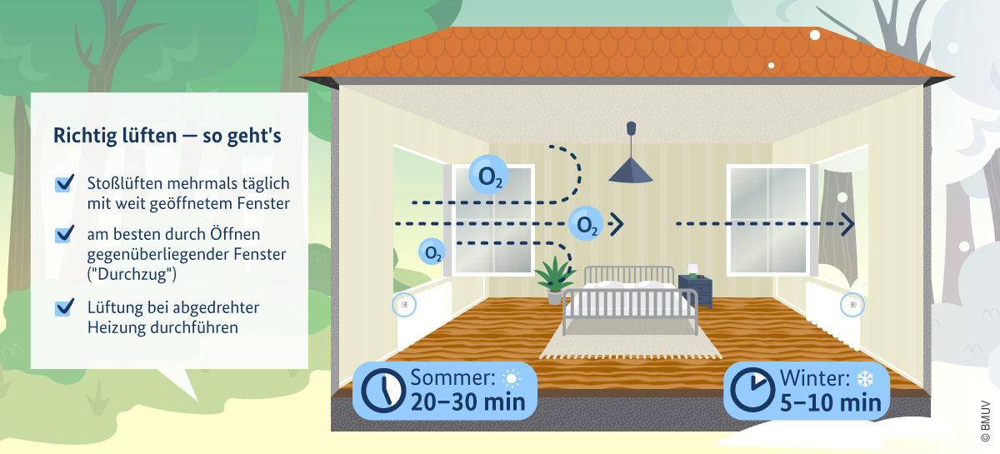
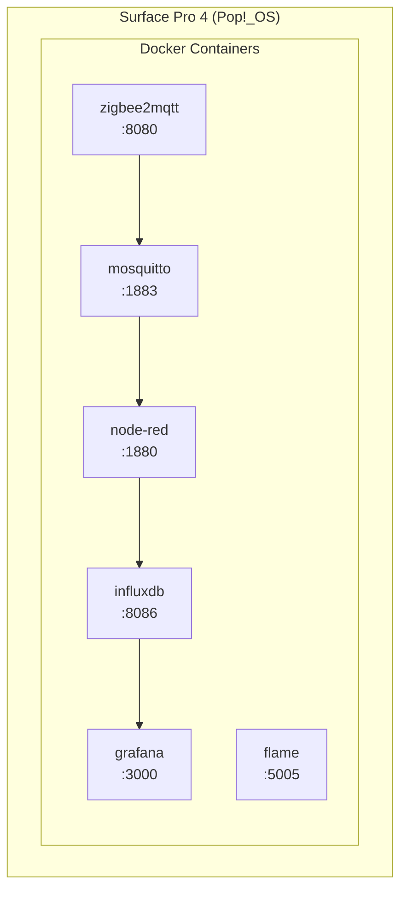
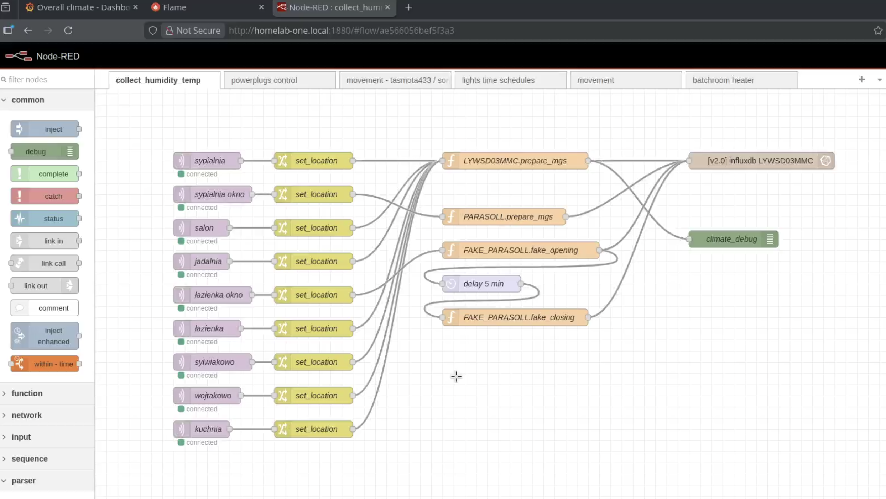
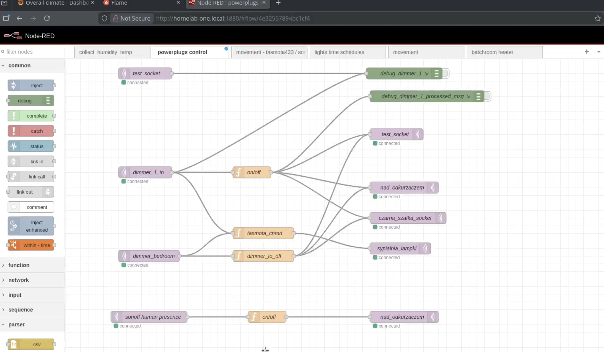
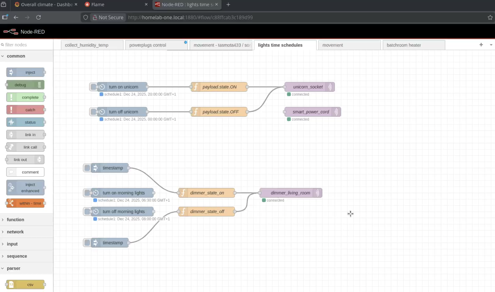
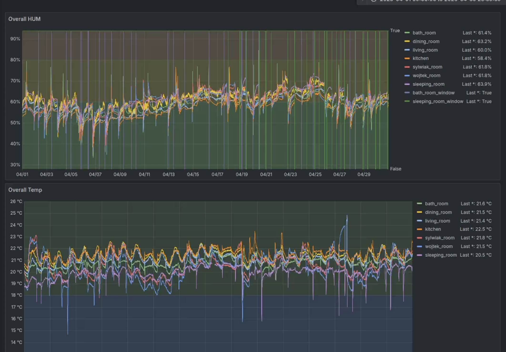
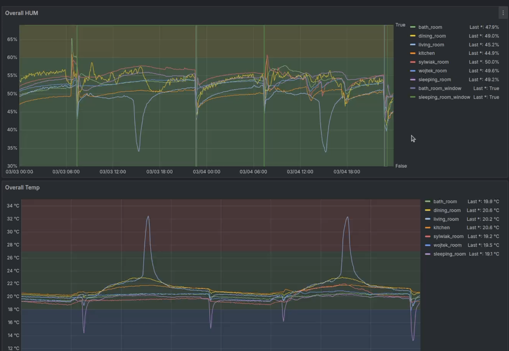
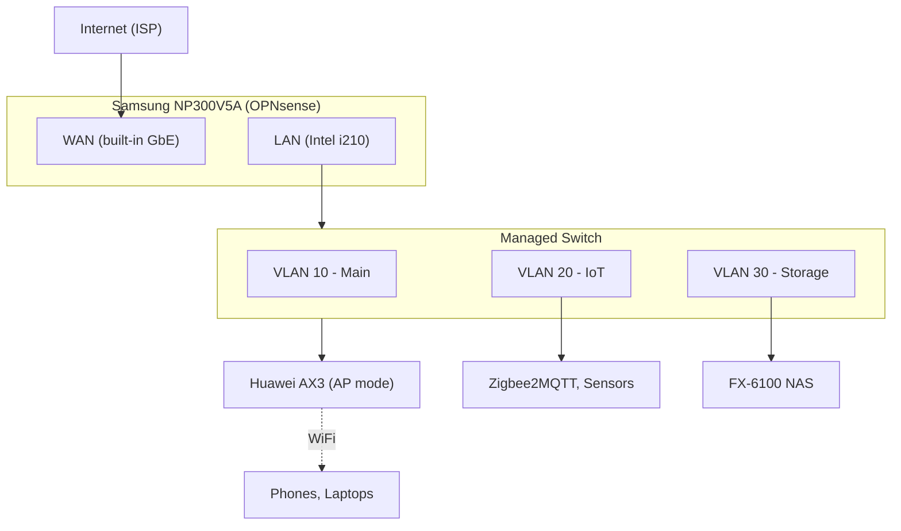
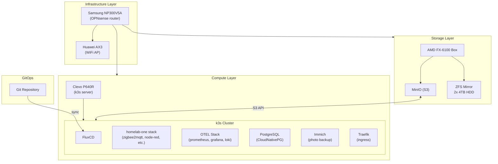

## small overview of what is below

### hardware

- IKEA stuff
  - [TRETAKT](https://www.ikea.com/pl/pl/p/tretakt-wtyczka-smart-00556513/)
  - [RODRET](https://www.ikea.com/pl/pl/p/rodret-bezprzew-przyciemniacz-przelacznik-smart-bialy-80559796/) (because it's cheaper, and I can play with dimming events 😎)
  - [STYRBAR](https://www.ikea.com/pl/pl/p/styrbar-pilot-zdalnego-sterowania-smart-bialy-60488366/)
  - [PARASOLL](https://www.ikea.com/pl/pl/p/parasoll-czujnik-do-drzwi-okna-smart-bialy-80504308/) (how otherwise I could proof I did some lueften)
- cheap tasmota relay (sonoff)
- cheap unknown 433mhz sensors motion
- cheap sonoff 433mhz gateway (433mhz -> mqtt)
- surface pro 4 (i7, 16gb of ram, 512gb of ssd)
  - [pop_os](https://system76.com/pop/) (with [cosmic](https://system76.com/cosmic), for fun)

### actual implementation 

- [flame](https://github.com/pawelmalak/flame) (give the author a star ⭐️)
- zigbee2mqtt
- mosquito 
- node-red
- influxdb
- grafana

### missing pieces

- backups
- secrets

### next steps

- repo (actually there is one, but just for backup purposes -> [temp_collector](https://github.com/gulasz101/temp_collector/tree/main))
- k3s (fluxcd + k3s + some gitops exercises)

## Intro

So overall below there is nothing more extraordinary than you can find over internet. However it is always good to write down your journey and maybe someone will find it useful.

So this small writing is about my not so first attempt to get into homelab hobby with not so smart home automation.

Why not so small automation? Because I usually like to understand what is happening behind the scenes. Installing [Home Assistant](https://www.home-assistant.io/), adding few sensors and calling it a day would be a nice activity, but having better visibility into how my data is collected and is getting me more excited.

### How I even got into idea?

So in general for time being I'm living in Germany. Common problem in apartments here, even every native German will tell you that they never had this problem, is a mold and humidity in apartments 😅

### Lüften

To avoid mould you have to follow very specific procedure, locals are doing religiously ;)

When I'm saying religiously, I mean... there is a [government page](https://www.bundesumweltministerium.de/themen/gesundheit/innenraumluft/richtiges-lueften-und-heizen) explaining how to approach the problem 🤯



And since I live in very old building (built in 1870s if I'm not mistaken), the problem is rather annoying. Even more annoying when my landlord started questioning if I'm even doing what I should do to keep humidity level in my apartment on safe level. (you can find some good stories on YT or IG explaining how confusing the problem is to expats here)

But to the point.

I needed first to see the correlation between weather conditions outside and what is happening in my apartment.

As well as I also wanted to proof to my beloved landlord that Lüften is happening here for real. And I'm taking it as serious as I can 😎

## Hardware

### LYWSD03MMC

Internet is flooded with those devices :) It is cheap, highly available and.. you can swap firmware so device instead of using bluetooth LE uses zigbee. (more info [here](https://github.com/devbis/z03mmc))

> **Bonus point** does not transfer your data through China
{: .prompt-info }


Over years of buying random stuff from Ali for DIY projects that I will "definitely finish next weekend" I ended up with few of them. Initially some years ago I had rpi running small shell script collecting data from those devices over BLE but it was draining battery within 2 months.. so not really ideal.

### cc2531

Once I have temp / humidity sensors I needed to somehow collect data into single place. So what is looking as current standard in DIY home automation is... zigbee2mqtt.

Easy!

But first somehow you need to be able to receive zigbee. As always our friends from behind of Great Wall are coming with some cheap toys :) I would personally not use again the `cc2531` as it is fairly limited. What I mean by that, it can only receive and can not behave as a router in your mesh.

So in general I would simply go for some off the shelf zigbee2mqtt solution, sonoff seems to be quite popular.

However, after going through all the hustle documented [here](https://www.zigbee2mqtt.io/guide/adapters/flashing/flashing_the_cc2531.html#linux-or-macos), we are ready to collect this data. Because now we are receiving zigbee, and broadcasting it over our normal wifi network using mqtt protocol.

> **2025-12-08** Actually recently migrated to [ZBDongle-E 3.0 USB Dongle Plus](https://amzn.eu/d/gn8OYZ6)
{: .prompt-warning }

### mqtt and mosquitto

So to make data fly over our wifi we need some mqtt broker :) Here to the rescue comes *mosquitto*. 

Small piece of software that can run on literally anything, that enable us to subscribe to any topic that is being present on the broker.

> `zigbee2mqtt` I'm actually planning to move to separate device... so I guess I will just have pi zero w running single docker container. This way I do not have anything in my upcoming k3s setup interacting with usb hardware. To keep stuff simple.
{: .prompt-info }
... or I have to dig into [mdsn zeroconf discovery topic](https://www.zigbee2mqtt.io/guide/configuration/adapter-settings.html#mdns-zeroconf-discovery)

### IKEA stuff

You know IKEA, right? The one with meatballs and instructions that make you question your life choices. Well, they also have smart home stuff that is surprisingly good and cheap.

What I'm using:
- **TRETAKT** - smart plugs. Nothing fancy, but works solid with zigbee2mqtt
- **RODRET** - dimmer switches (cheaper than STYRBAR and I can play with dimming events 😎)
- **STYRBAR** - remote control for lights
- **PARASOLL** - door/window sensors. This one is my proof to landlord that windows are being opened!

All those devices speak zigbee, so they join nicely to my mesh.

### 433mhz sensors

Before going full zigbee I also bought some cheap 433mhz motion sensors and a sonoff 433mhz gateway. Gateway runs tasmota firmware and publishes everything to mqtt. Not ideal but hey, it was cheap and it works. At least for bathroom window sensor where I didn't want to spend money on PARASOLL :)

### Surface Pro 4

So where does all this run? On a Surface Pro 4 that was collecting dust in my drawer. i7, 16GB RAM, 512GB SSD. Bit overkill for this project but I had it laying around.

Running Pop!_OS with Cosmic UI just for fun. Works surprisingly well for a Surface device. Especially after installing [linux-surface](https://github.com/linux-surface/linux-surface) kernel.

## Current Stack

```yaml
services:
  zigbee2mqtt:
    image: koenkk/zigbee2mqtt
    container_name: zigbee2mqtt
    environment:
      - TZ=Etc/UTC
    volumes:
      - ./zigbee2mqtt/config/:/app/data
      # - ./zigbee2mqtt/data:/app/data
      - /run/udev:/run/udev:ro
    devices:
      # - /dev/ttyACM0:/dev/ttyACM0  
      - "/dev/serial/by-id/usb-Itead_Sonoff_Zigbee_3.0_USB_Dongle_Plus_V2_b2716f8592c2ef1191f1c6138148b910-if00-port0:/dev/ttyUSB0"
    depends_on:
      - mosquitto
    ports:
      - 8080:8080
    restart: always

  mosquitto:
    image: eclipse-mosquitto
    container_name: mosquitto
    ports:
      - 1883:1883
    volumes:
      - ./mosquitto/config:/mosquitto/config
      - ./mosquitto/data:/mosquitto/data
      - ./mosquitto/log:/mosquitto/log
    restart: always

  node-red:
    build: ./node-red/
    container_name: node-red
    # network_mode: host
    environment:
      - TZ=Etc/UTC
    ports:
      - 1880:1880
    volumes:
      - ./node-red/data:/data
    depends_on:
      - mosquitto
      - influxdb
    restart: always

  influxdb:
    image: influxdb:2 
    container_name: influxdb
    ports:
      - 8086:8086
    volumes:
      - ./influxdb2/data:/var/lib/influxdb2
    environment:
      - DOCKER_INFLUXDB_INIT_MODE=setup
      - DOCKER_INFLUXDB_INIT_USERNAME=${DEFAULT_USERNAME}
      - DOCKER_INFLUXDB_INIT_PASSWORD=${DEFAULT_PASSWORD}
      - DOCKER_INFLUXDB_INIT_ORG=${INFLUXDB_ORG}
      - DOCKER_INFLUXDB_INIT_BUCKET=${INFLUXDB_BUCKET}
      - DOCKER_INFLUXDB_INIT_ADMIN_TOKEN=${INFLUXDB_TOKEN}
      - INFLUXDB_DB=sensordata
      - INFLUXDB_ADMIN_USER=admin
      - INFLUXDB_ADMIN_PASSWORD=adminpassword
    restart: always

  grafana:
    image: grafana/grafana
    container_name: grafana
    ports:
      - 3000:3000
    volumes:
      - ./grafana/data:/var/lib/grafana 
      - ./grafana/provisioning:/etc/grafana/provisioning
    environment:
      - GF_SECURITY_ADMIN_USER=${DEFAULT_USERNAME}
      - GF_SECURITY_ADMIN_PASSWORD=${DEFAULT_PASSWORD}
      # - INFLUXDB_USERNAME=${DEFAULT_USERNAME}
      - INFLUXDB_URL=${INFLUXDB_URL}
      - INFLUXDB_BUCKET=${INFLUXDB_BUCKET}
      - INFLUXDB_TOKEN=62gms_7z5__wdtm2lKIZ3oXilda3NExC47W0bPlKGro0wz79J4a9Y9W2lKwgIkUIZlp1GXipFqgp49A-Z7EzlA==
      # - INFLUXDB_ORG=${INFLUXDB_ORG}
    depends_on:
      - influxdb
    restart: always
  flame:
    image: pawelmalak/flame
    container_name: flame
    volumes:
      - ./flame/data:/app/data
      - /var/run/docker.sock:/var/run/docker.sock 
    ports:
      - 5005:5005
    environment:
      - PASSWORD=password
    restart: unless-stopped

```

Everything runs in docker compose. Simple, works, easy to backup. Here is what I have:



### Data flow

1. Sensors broadcast zigbee signals
2. ZBDongle receives them, zigbee2mqtt translates to mqtt messages
3. Mosquitto broker distributes messages to subscribers
4. Node-Red picks up messages, transforms them, stores in InfluxDB
5. Grafana displays pretty charts

For 433mhz sensors path is a bit different - sonoff gateway with tasmota publishes directly to mosquitto.

### Node-Red flows

I have few flows running:
- **collect_humidity_temp** - main flow that grabs data from all LYWSD03MMC sensors and stores in influxdb. Each sensor has its location tag (sleeping_room, living_room, bath_room, etc.)
- **powerplugs control** - dimmer switches controlling IKEA power plugs (those are magnetic! you can attach them to your bed frame... so once you are there... you do not have to wake up any more, you can turn everything off with one "loooong press", ha! told that I can make use of dimming events 😎)
- **tasmota433** - handling 433mhz motion sensors
- **lights time schedules** - turn on/off lights based on time (unicorn lamp for neighbours 🦄)
- **movement** - motion-triggered lights

What I like about Node-Red is that you can see exactly what is happening with your data. No magic, just visual flows connecting inputs to outputs. And some very basic javascript for parsing msg payloads.

So as you see below... nothing fancy, rather ordinary simple, but it works. And it works since more than a year...

#### collecting humidity



#### power-plugs (lights) control



#### unicorn schedule 🦄



### Grafana dashboards

Finally some visibility! I can see humidity levels across all rooms, temperature trends, battery status of sensors. And most importantly - I have proof that windows are being opened regularly.

OFC I was bit disappointed seeing that at certain moments there is actual proper correlation between window opening and humidity... but at the end less than landlord promised... so...

Take that, landlord! Everything below can be exported to excel 📊📈



##### 😔 disappointing correlation



## What is missing

### Backups

Yeah... this is embarrassing. Currently my only "backup" is git repo with docker compose file and some configs. If Surface dies tomorrow I would need to reconfigure everything from scratch.

Need to fix this. 👨🏻‍🔧

### Secrets management

Passwords are in `.env` file. Token values hardcoded. Not great, not terrible. But should be better.

Since it just runs in my local network, not really a huge security risk... but still, nothing to be proud of 😒

### Proper monitoring

Ironic that I work with monitoring stacks at work but my homelab has none. No alerts, no notifications when sensor battery is low, nothing.

😏 otel perhaps? How can I over-engineer this problem even more? 😏

## Where I'm going with this

So this is where it gets interesting. Current setup works fine but I have bigger plans.

### Network upgrade - Samsung laptop router

Before I can do anything serious, I need proper network. Currently everything runs through standard ISP router which is... fine, I guess. But no VLANs, no proper firewall, no fun. (plug and play and works... who would want that?!)

So I have old Samsung NP300V5A laptop that will become my OPNsense router. Plan is simple:
- Replace internal WiFi card with Intel i210 mini PCIe NIC (around €30 on eBay)
- Built-in Gigabit Ethernet becomes WAN port
- Intel NIC becomes LAN port
- Install OPNsense and configure VLANs, firewall rules, WireGuard VPN

For WiFi I have two Huawei AX3 (AX3000, Chinese version) routers. One will run in AP mode, connected to managed switch. Second one stays as backup or for different room if coverage is not enough. They support OpenWrt so I can flash it later if I want multiple SSIDs for different VLANs.

Network topology will look something like this:



Why separate VLANs? IoT devices should not have access to my main network. Storage should be accessible only from main network. Guest WiFi should be isolated. Basic security stuff that ISP router cannot do.

### The sentimental storage box - AMD FX-6100

Ok, this one is not logical at all. I have old AMD FX-6100 system that I could just sell or throw away. But here is the thing - this was my first PC that I bought with my own money. Back when I was young and FX CPUs were actually new and exciting (yes, I'm that old 😅).

So instead of getting rid of it, I decided to give it new life as dedicated storage node.

#### **Current specs:**

- AMD FX-6100 (6 cores, 3.3GHz, no AVX2 unfortunately)
- Motherboard: ASRock 970 Pro3 (AM3+) with 6x SATA ports
- RAM: 16GB DDR3
- GPU: MSI N630GT-MD4GD3 (will probably replace with passive GT 710 for less noise)

#### **What it will run:**

- Debian + Docker (keeping it simple) or OpenMediaVault
- MinIO for S3-compatible object storage
- ZFS mirror with 2x 8TB HDDs
- Backup sync to Backblaze B2 (some simple cronjob doing sync)

The FX-6100 is not great for running containers - single thread performance is weak and no AVX2 means no modern ML workloads. But for storage? Perfect. It has 6 SATA ports, low power consumption when idle, and most importantly - it has sentimental value that cannot be measured in benchmarks 🖤 (first PC bought for money from my first internship).

### Compute node - Clevo P640R

🖤 Second device I bought with own money 💸

For actual compute I have Clevo P640R gaming laptop. Much more capable:
- CPU: Intel i7-6700HQ (4c/8t, Skylake, has AVX2!)
- RAM: 32GB DDR3L
- GPU: GTX 960M (not really useful for this but nice to have)

This will be my k3s control plane. I'm even thinking about taking out the motherboard from laptop chassis and mounting it standalone with better cooling. Laptops are not designed to run 24/7 under load, but bare motherboard with proper fan could work much better.

### Architecture v2.0

Here is the full picture of what I'm building:



### Why separate storage and compute?

Few reasons:
1. **Different hardware requirements** - storage needs lots of SATA ports and reliability, compute needs CPU power and RAM
2. **Independent scaling** - can add more storage disks without touching compute, can add more compute nodes without touching storage
3. **Failure isolation** - if compute node dies, my data is still safe on storage box
4. **Sentimental value** - FX-6100 stays alive and useful 😊💪

### FluxCD on storage box?

Actually, I'm now thinking - maybe I should run FluxCD source controller on the FX-6100 box. It would keep git repository data there, and storage is more reliable than compute node anyway. Something to experiment with.

### k3s and GitOps

Current docker compose approach is fine for small setups but doesn't scale well. With k3s I get:
- Proper secrets management (SOPS, sealed-secrets, or external-secrets with Vault)
- GitOps with FluxCD - everything declared in git, automatically synced to cluster
- Easy horizontal scaling when I add more nodes
- Real ingress with Traefik and proper TLS certificates

Yes, it is overkill for home automation. But this is also my learning playground. I work with Kubernetes at my day job and having homelab to experiment with is priceless.

Also I'm planning to get away from google photos and stop paying for google one, so me and my wife will start using home network for storing files, sharing photos, storing nice media library.

## Summary

So that's my homelab journey so far. Started with simple goal - prove to landlord that I do Lüften properly. Ended up with docker compose stack monitoring humidity across entire apartment.

And now I'm planning kubernetes cluster with proper network segmentation and distributed storage because... why not? 🤷

If you have questions or want to see specific parts in more detail, let me know. Repository with current setup is [here](https://github.com/gulasz101/temp_collector/tree/main) - it's messy but it works.

Cheers! 🍺

ps. surface will get new life as well... looks like I will make myself [nobara](https://nobaraproject.org/) tablet 🤩
