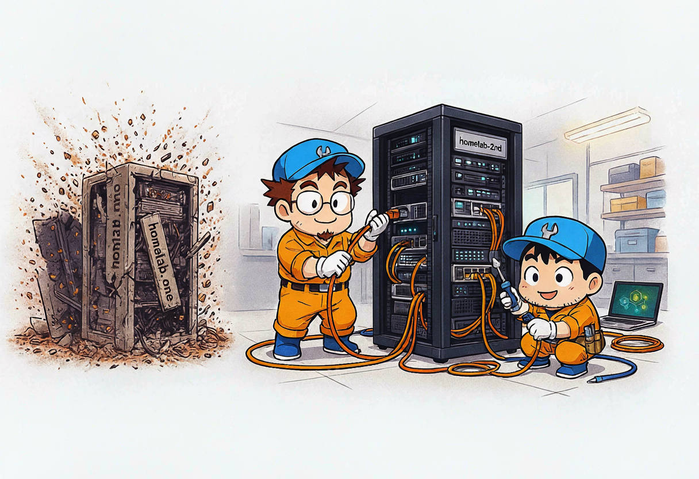
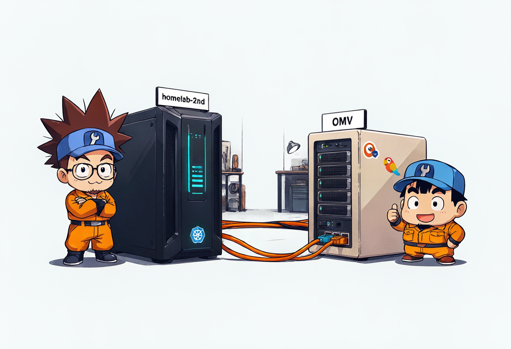
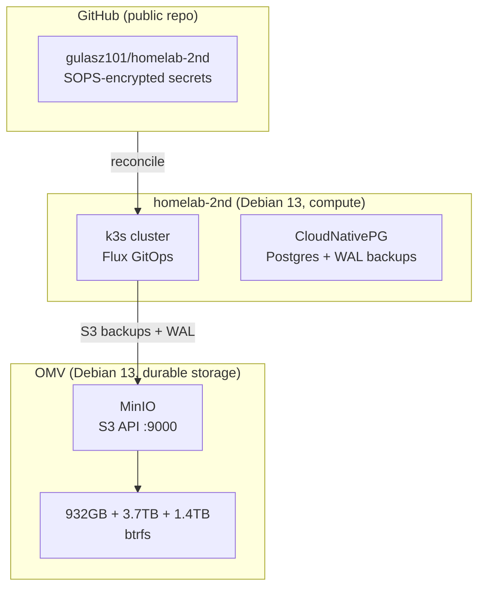

## So... another homelab post 😅

Yeah, I know. I already wrote about my homelab adventure — the one that started because of mold in my German apartment and a landlord who needed proof that I open my windows. That was `homelab.one`: zigbee sensors, mqtt, node-red, grafana, Surface Pro 4 doing its best.

But you know how it goes. You start with one docker compose file, everything works fine, and then you wake up one day and you're bootstrapping a Kubernetes cluster in your living room because "it would be nice to have proper GitOps" 🤷

So this is the story of `homelab-2nd`. A fresh build, on different hardware, with actual architecture decisions this time. And since I'm documenting every single step anyway (for myself, mostly), I might as well turn it into blog material.

Let me explain what I'm building and why. The actual step-by-step posts will follow.

## The goal

One sentence:

> Stand up a secure, GitOps-driven self-hosted platform on `homelab-2nd`, with OMV as durable storage, to host services starting with Mattermost.

Mattermost? Yes. I want my own chat platform — invite-only, for me, my wife, and a few friends. No SMTP, no email registration, no public signups. Just a private place to talk that I control end to end.

And because I do things the hard way (it's more fun that way 😎), the whole thing is going to be GitOps from day one. Everything in a public repo, reconciled by Flux, secrets encrypted with SOPS. No `kubectl apply -f` unless it's bootstrap or break-glass.

## The hardware



Two boxes, clear roles:

| Node | Role | Specs |
|------|------|-------|
| **homelab-2nd** | Compute + ephemeral storage | Debian 13, 8 vCPU, 31 GB RAM, 408 GB NVMe (LVM). LAN `192.168.1.179`. |
| **openmediavault (OMV)** | Durable NAS + object storage | Debian 13, 6 cores, 15 GB RAM. Drives: 932 GB, 3.7 TB, 1.4 TB. |

The split is deliberate:

- **homelab-2nd is NOT durable.** If it dies tomorrow, I can rebuild it from the repo + backups. Live DB PVCs run on `local-path` NVMe for speed, but durability comes from elsewhere.
- **OMV is the ONLY durable store.** That's where backups live. That's where MinIO runs. That's the box I actually care about not losing.



Why separate storage and compute? Same reasons as before — different hardware needs, independent scaling, failure isolation. But this time I'm being explicit about it from the start instead of figuring it out as I go 😅


## The rules (architecture decisions, locked)

I wrote myself a briefing before touching any hardware. These are the decisions I'm not going to relitigate:

### 1. GitOps is law

Repo: `github.com/gulasz101/homelab-2nd` (public, because why not — secrets are encrypted anyway).

Flux reconciles the repo into the cluster. `HelmRepository` + `HelmRelease` first. Raw manifests only when no sane chart exists (and I have to justify it). Hand-applied `kubectl`/`helm` is ONLY for bootstrap and break-glass, and it gets documented every time.

### 2. CloudNativePG for every Postgres

No standalone Postgres charts. No StatefulSets with manual init scripts. Every Postgres instance is a CNPG `Cluster` resource, with live PVC on local-path and backups + WAL archiving going to OMV MinIO S3. Configured from day one, not bolted on later.

### 3. SOPS + age for secrets

The repo is **public**. That means zero plaintext secrets, period. Fresh age keypair generated for this homelab:

- Public key → goes in `.sops.yaml` in the repo. Safe to share.
- Private key → goes in my password manager. Never committed, never logged.

All credentials are SOPS-encrypted `*Secret` resources, decrypted in-cluster by Flux at reconciliation time.

```yaml
# .sops.yaml — only encrypts data/stringData fields, rest stays readable
creation_rules:
  - path_regex: .*.yaml
    encrypted_regex: ^(data|stringData)$
    age: age195fednlfd8q35tvyvf7umlseu4ez37k2m2d0wjawmje6nr9kzgyquhau9s
```

### 4. Cloudflare Tunnel for ingress

No open router ports. Origin is hidden. The public never sees my home IP.

This requires moving DNS nameservers from OVH to Cloudflare for `voitech.dev` — and before flipping, I need to recreate all existing DNS records in Cloudflare so nothing breaks. The apex record, MX records (even though OVH says no mailbox is actually enabled... classic), TXT records. Then add `homelab.voitech.dev` CNAME pointing to the tunnel.

cert-manager + Let's Encrypt (or Cloudflare origin certs) handles TLS.

### 5. MinIO on OMV (not NFS, not local)

OMV runs Docker + MinIO as the S3 backend for the whole homelab. Not NFS — I want S3-compatible object storage because that's what CNPG, Loki, and everything else in 2026 expects. MinIO is version-controlled in the repo even though OMV is outside Flux's reach. It's backing-store infrastructure, applied via SSH + documented.

## First activity build order

Here's the plan, in order:

1. **Passwordless sudo** for `gulasz101` on homelab-2nd (so the agent can do stuff over SSH without interactive prompts)
2. **Docker + MinIO on OMV** — durable S3 backend, version-controlled
3. **age keypair + SOPS** wired into the repo
4. **k3s bootstrap** on homelab-2nd + Flux bootstrapped onto the repo
5. **CNPG** for Mattermost Postgres, with S3 backups → OMV MinIO
6. **cert-manager + Cloudflare Tunnel** ingress for `homelab.voitech.dev` (DNS migration first)
7. **Mattermost** via HelmRelease — invite-only, file storage → MinIO, Postgres via CNPG

Every step gets tracked in dated notes. Those notes become these blog posts. That's the deal.

## What I'm not doing

A few things I explicitly decided against, so I don't tempt myself later:

- **No traefik.** k3s bundles it but I disabled it. Cloudflare Tunnel handles ingress.
- **No servicelb.** Same — no LoadBalancer needed.
- **No SMTP/email for Mattermost.** OVH has no mailbox enabled on this domain anyway. It's invite-only for a handful of people.
- **No 1Password automation.** I'll store the age key in my password manager manually for now. Migrating off 1Password to Bitwarden/self-hosted is a separate future problem.

## Why bother?

Honestly? Because this is my learning playground. I work with Kubernetes at my day job, and having a homelab to break things in is priceless. The Lüften post was about proving something to my landlord. This one is about proving something to myself — that I can build a platform properly, end to end, with GitOps from day one and secrets done right.

Is it overkill for a chat app used by five people? Absolutely 😎

Am I going to do it anyway? You bet.

## What's next

The next post will be the actual first steps — setting up the `gulasz101` user, installing k3s, bootstrapping Flux, and wiring SOPS. The boring-but-important foundation stuff that makes everything else possible.

Repo is here if you want to follow along: [github.com/gulasz101/homelab-2nd](https://github.com/gulasz101/homelab-2nd)

Cheers! 🍺