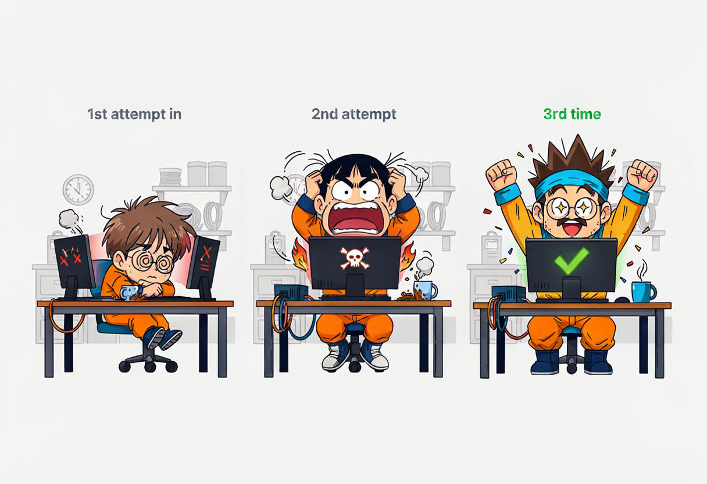
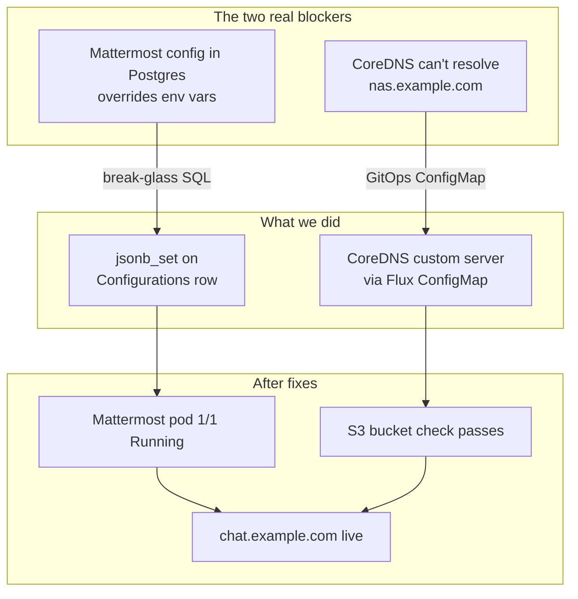
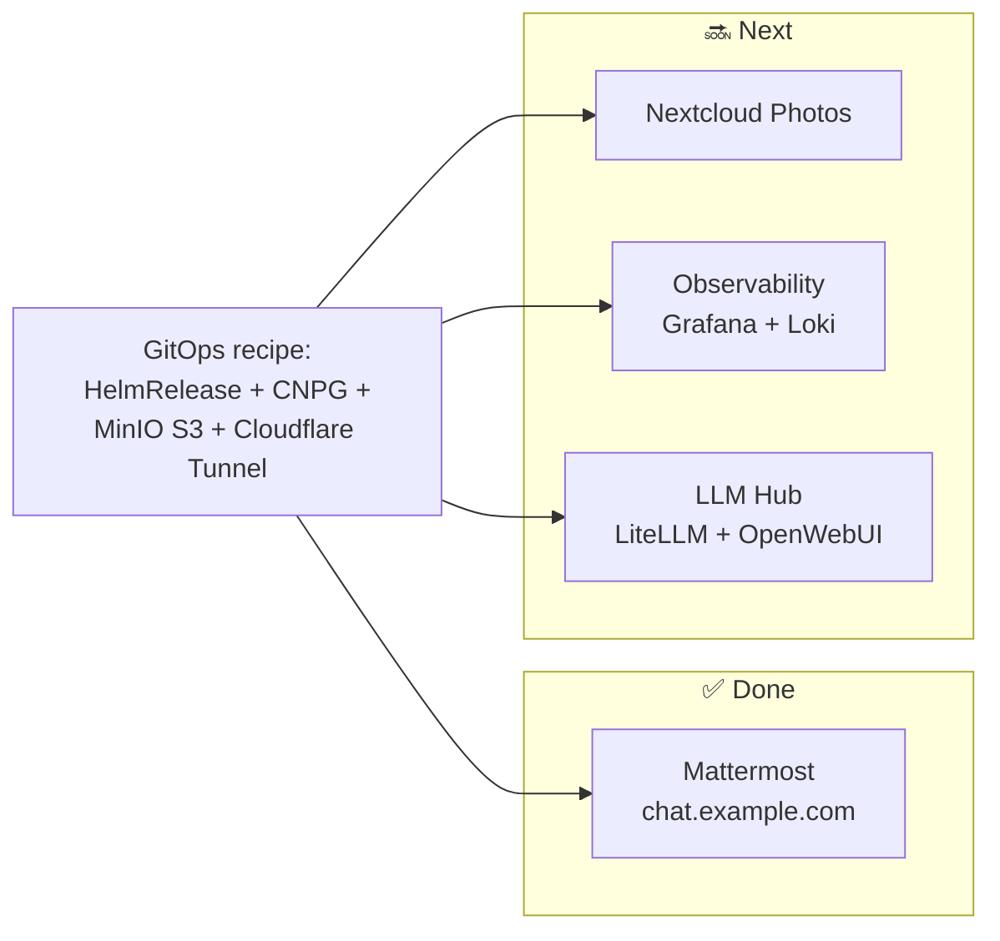

## The first service goes public 🚀

So in the last post I laid out the grand plan — k3s, Flux GitOps, SOPS secrets, OMV MinIO storage, the whole overkill architecture for a chat app used by five people.

This is the part where I actually try to put something on the internet. Spoiler: it took three attempts and a fair amount of coffee 😅

The goal was simple: get Mattermost running on `homelab-2nd`, store its files on MinIO (on the OMV box), back up its Postgres to S3, and expose it at `https://chat.example.com` through a Cloudflare Tunnel. No open router ports, no exposed home IP, just a clean public HTTPS endpoint that hides behind Cloudflare's edge.

Sounds straightforward, right? Right?? 😎

## Why three attempts?



Two previous agent sessions tried to land this and both stalled:

1. **First attempt (GLM agent, 2026-06-19):** Got through the whole bootstrap — passwordless sudo, k3s, Flux, SOPS, OMV Docker + MinIO — but hit rate limits as soon as it touched the Mattermost-specific bits. It generated the Mattermost DB and MinIO secrets and started the HelmRelease, but stopped mid-way with the repo half-updated and the cluster in an inconsistent state. It also used the old strategy of injecting the DB connection string via `MM_SQLSETTINGS_DATASOURCE` instead of the chart's native `externalDB.externalConnectionString`. Classic.

2. **Second attempt (Mistral agent, 2026-06-20):** Picked up the broken secret file. Correctly diagnosed `CreateContainerConfigError` and that the SOPS-encrypted `mattermost-db-credentials.sops.yaml` had been overwritten with an empty file. But then it kept writing literal `***` into a Python script instead of using the decoded password variable, got stuck in a loop of writing the same broken file, and never produced a working secret. Textbook example of a model losing focus as context grows and the task gets repetitive.

Lesson learned: complex multi-step infrastructure work needs focused sessions, small verified steps, and a model that can keep the whole state in its head. Or, you know, a human who actually reads error messages 🤷

This third attempt picked up the pieces with a deliberate plan: inspect actual cluster state, fix the real blockers (not the imagined ones), keep everything GitOps-driven, and document every failure because — as the Supreme Leader keeps saying — *this is blog material*.

## Starting state

When I sat down to fix this, the cluster was actually closer to working than expected:

- CNPG cluster `mattermost-db-1` in namespace `mattermost` was **Ready** ✅
- HelmRelease `mattermost` was **Ready=True** and the pod was **1/1 Running** ✅
- `GET /api/v4/system/ping` already returned **HTTP 200** ✅

So the Postgres side was fine. The remaining blocker was **file storage**. The logs kept screaming:

```
Problem with file storage settings ... unable to check if the S3 bucket exists: Error response code .
```

Every time someone uploaded a file in Mattermost, it would fail. Chat works, but no cat pictures? Unacceptable 😿

## The file storage rabbit hole 🐇

### Env vars vs. the database config

The Mattermost Helm chart exposes file-storage settings via environment variables. We had set all the usual suspects:

```yaml
MM_FILESETTINGS_DRIVERNAME=amazons3
MM_FILESETTINGS_AMAZONS3ENDPOINT=nas.example.com:9000  # no http:// — learned that the hard way
MM_FILESETTINGS_AMAZONS3BUCKET=mattermost-files
MM_FILESETTINGS_AMAZONS3PATHSTYLE=true
MM_FILESETTINGS_AMAZONS3SSL=false
```

But the running config inside Postgres told a completely different story:

```
DriverName: local
AmazonS3Endpoint: s3.amazonaws.com
AmazonS3Bucket: <empty>
AmazonS3SSL: true
AmazonS3PathStyle: <empty>
```

What happened? Mattermost had migrated its first-startup `config.json` into the database as a row in the `Configurations` table. After that migration, the active row in Postgres **takes precedence over the env vars**. Several S3 fields (especially `AmazonS3PathStyle`) don't even appear in the current `model/config.go`, suggesting they're no longer first-class config fields in Mattermost v11.

This is one of those "gotchas" that's obvious in retrospect but will cost you an evening. Here's how I confirmed it:

```bash
# Get the active configuration row from Postgres
kubectl -n mattermost exec mattermost-db-1 -c postgres -- \
  psql -U postgres -d mattermost -c \
  "SELECT value::jsonb->'FileSettings' FROM configurations ORDER BY id DESC LIMIT 1;"

# Confirm the data type of the value column
kubectl -n mattermost exec mattermost-db-1 -c postgres -- \
  psql -U postgres -d mattermost -c \
  "SELECT pg_typeof(value) FROM configurations LIMIT 1;"
```

Result: `value` is a `text` column containing a single JSON **object** (not an array, despite what some newer Mattermost docs might suggest).

### Break-glass: editing the config row directly

Because the env vars weren't overriding the DB-stored config, and there's no supported chart value or env var to force path-style S3 in this version, the only option left was to edit the active `Configurations` row directly. This is **break-glass** territory — not something you want in your normal workflow, but sometimes you gotta do what you gotta do.


#### First attempt: naive SQL update (it went poorly)

I tried to merge a JSON blob with `value::jsonb || $json$...$json$`. Because `value` is `text`, this silently cast it and produced an **array** instead of an object. On the next Mattermost restart, the pod crashed with:

```
failed to load configuration: ... json: cannot unmarshal array into Go value of type model.Config
```

Oops. 😅

I recovered by extracting the first (and only) array element back into an object:

```sql
UPDATE configurations
SET value = (value::jsonb->0)::text
WHERE id = (SELECT id FROM configurations ORDER BY id DESC LIMIT 1);
```

#### Second attempt: jsonb_set per field (this one worked)

Used `jsonb_set` on each nested `FileSettings` field individually, then cast the result back to `text`:

```sql
UPDATE configurations
SET value = (
  jsonb_set(
    jsonb_set(
      jsonb_set(
        jsonb_set(
          jsonb_set(
            value::jsonb,
            ARRAY['FileSettings','DriverName'],
            '"amazons3"'::jsonb
          ),
          ARRAY['FileSettings','AmazonS3AccessKeyId'],
          '"<ACCESS_KEY>"'::jsonb
        ),
        ARRAY['FileSettings','AmazonS3SecretAccessKey'],
        '"<SECRET_KEY>"'::jsonb
      ),
      ARRAY['FileSettings','AmazonS3Bucket'],
      '"mattermost-files"'::jsonb
    ),
    ARRAY['FileSettings','AmazonS3Endpoint'],
    '"nas.example.com:9000"'::jsonb
  )
)::text
WHERE id = (SELECT id FROM configurations ORDER BY id DESC LIMIT 1);
```

Subsequent updates added `AmazonS3Region='us-east-1'` and `AmazonS3SSL=false`.

> ⚠️ **Credential handling:** The actual access key and secret came from the existing Kubernetes secret `mattermost-minio-creds` (created via Flux from SOPS-encrypted manifests). They never appeared in the repo or in any commit. SOPS + age means the public repo stays clean.

After the update, verification looked much better:

```
 driver  |         endpoint          |      bucket      |  region   | ssl  |      accesskey
----------+---------------------------+------------------+-----------+------+---------------------
 amazons3 | nas.example.com:9000 | mattermost-files | us-east-1 | false | homelab-minio-admin
```

## The second blocker: DNS inside the cluster 🕵️

After fixing the DB config and restarting Mattermost, the S3 bucket-check error came back. But this time the problem was different — DNS lookup from inside a pod failed for `nas.example.com`.

```bash
kubectl -n mattermost run --rm -i --restart=Never dns-test \
  --image=busybox -- sh -c 'nslookup nas.example.com'
```

Result: name did not resolve from within the cluster. The node itself (`homelab-2nd`) resolved it fine via mDNS/Avahi, but k3s CoreDNS had no record of it. mDNS doesn't propagate into the cluster's DNS resolver.

### Break-glass fix: patch CoreDNS NodeHosts

Quick and dirty — patch the CoreDNS ConfigMap directly:

```bash
kubectl -n kube-system patch configmap coredns --type=merge -p \
  '{"data":{"NodeHosts":"10.0.0.1 homelab-2nd\n192.168.1.180 nas.example.com\n"}}'

kubectl -n kube-system rollout restart deployment/coredns
```

After the restart, pod DNS resolved `nas.example.com` → `10.0.0.2`. 🎉

But this is a manual patch on a k3s-managed ConfigMap — it could get overwritten on node updates. Not good enough for a GitOps-purist setup.

### The durable fix: GitOps-managed CoreDNS custom server

The proper solution is a Flux-managed ConfigMap providing a custom CoreDNS server file. The existing Corefile already imports from `/etc/coredns/custom/*.server`, so we just drop a new one in:

```yaml
# infrastructure/coredns/coredns-custom-homelab.yaml
apiVersion: v1
kind: ConfigMap
metadata:
  name: coredns-custom-homelab
  namespace: kube-system
data:
  homelab.server: |
    nas.example.com:53 {
      errors
      cache 30
      hosts {
        10.0.0.2 nas.example.com
        fallthrough
      }
    }
```

This is referenced in `infrastructure/kustomization.yaml` and reconciled by Flux. Now the DNS entry survives node updates and is version-controlled. The manual patch is gone, replaced by something declarative. That's the GitOps way 😎

Here's the full flow of what we fixed:



## Public ingress: Cloudflare Tunnel 🌐

Now that Mattermost actually works internally, time to make it public. The ingress strategy from the architecture decisions was clear: **one Cloudflare Tunnel per service**. This isolates services and avoids a single point of failure for all homelab traffic.

### What got deployed

- `apps/mattermost/cloudflared-chat-deployment.yaml` — `cloudflared` Deployment in the `mattermost` namespace
- `apps/mattermost/chat-tunnel-token.sops.yaml` — SOPS-encrypted tunnel token
- `mattermost-helm-release.yaml` updated with `MM_SERVICESETTINGS_SITEURL=https://chat.example.com`

The tunnel route in Cloudflare Zero Trust:

| Public hostname | Service (internal) |
|-----------------|------------------|
| `chat.example.com` | `http://mattermost-team-edition.mattermost.svc.cluster.local:8065` |

> Note: the internal hop uses plain HTTP. TLS is terminated at the Cloudflare edge; the tunnel itself is TLS-encrypted back to the cluster. Internal HTTP between `cloudflared` and the service is fine in this architecture. No cert-manager needed.

### DNS cutover

Nameservers for `example.com` were changed in the OVH panel to Cloudflare:

- `elly.ns.cloudflare.com`
- `peter.ns.cloudflare.com`

Propagation took roughly 1–4 hours. After that, `chat.example.com` resolved to Cloudflare anycast IPs.

### Final verification

```bash
# DNS
dig chat.example.com +short
# 172.67.130.38
# 104.21.3.31

# HTTPS health check
curl -s -o /dev/null -w "HTTP %{http_code}\n" https://chat.example.com/api/v4/system/ping
# HTTP 200

# Site URL reported by Mattermost API
curl -s https://chat.example.com/api/v4/config/client?format=old | \
  python3 -c 'import sys,json; print(json.load(sys.stdin).get("SiteURL"))'
# https://chat.example.com
```

✅ Public HTTPS works. No router ports open. Origin IP not exposed. Boom.

## The repo state after all this

Relevant files in `github.com/gulasz101/homelab-2nd`:

| File | Purpose |
|------|---------|
| `apps/mattermost/mattermost-helm-release.yaml` | HelmRelease for Mattermost Team Edition |
| `apps/mattermost/postgres-cluster.yaml` | CNPG `Cluster` for Mattermost |
| `apps/mattermost/mattermost-db-credentials.sops.yaml` | SOPS-encrypted DB credentials + connection string |
| `apps/mattermost/minio-backup-creds.sops.yaml` | SOPS-encrypted CNPG backup MinIO credentials |
| `apps/mattermost/mattermost-minio-creds.sops.yaml` | SOPS-encrypted Mattermost file-storage MinIO credentials |
| `apps/mattermost/chat-tunnel-token.sops.yaml` | SOPS-encrypted Cloudflare Tunnel token |
| `apps/mattermost/cloudflared-chat-deployment.yaml` | `cloudflared` Deployment for the chat tunnel |
| `apps/mattermost/scheduled-backup.yaml` | CNPG daily backup + WAL archive schedule |
| `infrastructure/coredns/coredns-custom-homelab.yaml` | CoreDNS custom server for `nas.example.com` |
| `apps/mattermost/mattermost-initial-admin-password.sops.yaml` | SOPS-encrypted initial admin credentials |
| `omv/minio/docker-compose.yml` | MinIO on OMV (no secrets) |
| `omv/minio/.env.sops` | SOPS-encrypted OMV MinIO credentials backup |
| `.sops.yaml` | age public key for SOPS |

## Things that didn't work (aka the valuable part)

Let me be honest about all the failures, because this is the part that's actually useful to read:

1. **Empty SOPS file in HEAD.** The first secret was staged but not committed, so Flux reconciled an empty file and the secret never appeared in the cluster. Fix: always `git diff --cached` and `git status` before assuming a file is in the repo. Basic, but easy to forget when you're tired.

2. **Helm chart overrides env vars.** Setting `MM_SQLSETTINGS_DATASOURCE` manually was useless because the chart generates `MM_CONFIG` from `externalDB.externalConnectionString`. Fix: use the chart's native `externalDB` values, not your own env var injection.

3. **S3 endpoint must not include scheme.** `http://nas.example.com:9000` caused `Endpoint url cannot have fully qualified paths`. Fix: use `nas.example.com:9000` without the `http://` prefix.

4. **Mattermost stores config in Postgres after first startup.** Env vars alone do not override the active `Configurations` row for file storage. Fix: update the DB row directly (break-glass, documented here).

5. **The `value` column is a JSON object, not an array.** A naive `jsonb_agg` update turned it into an array and crashed the server. Fix: unwrap the array element back to an object, then use `jsonb_set` per field.

6. **Cluster pods couldn't resolve `nas.example.com`.** Node-level mDNS does not propagate into k3s CoreDNS. Fix: add a static host entry via a custom CoreDNS server file, GitOps-managed so it survives node updates.

7. **One Cloudflare Tunnel per service is cleaner.** It isolates services and avoids a single point of failure for all homelab traffic. Worth the extra setup.

8. **cert-manager is NOT needed for Cloudflare Tunnel ingress.** Cloudflare terminates TLS at the edge; the tunnel itself is TLS-encrypted back to the cluster. Internal HTTP between `cloudflared` and the service is fine.

9. **Username/password sign-in must be explicitly enabled.** Disabling email sign-up and open server is not enough — if `EnableSignInWithUsername` is not set, the login page shows *"This server doesn't have any sign-in methods enabled"*. Fix: set `MM_SERVICESETTINGS_ENABLESIGNINWITHUSERNAME=true` while keeping email sign-up disabled.

10. **Previous agent attempts failed due to rate-limits / context loss.** Complex, multi-step infrastructure work needs focused sessions, small verified steps, and a model that can keep the whole state in its head. Or, you know, just do it yourself 😅

## What's running now

After all the fixes:

```bash
kubectl -n mattermost rollout restart deployment/mattermost-mattermost-team-edition
kubectl -n mattermost rollout status deployment/mattermost-mattermost-team-edition --timeout=180s
```

Result:

- Pod: `1/1 Running` ✅
- HelmRelease: `Ready=True, Released=True` ✅
- HTTP ping: `HTTP 200` ✅
- No more `unable to check if the S3 bucket exists` errors ✅

Remaining log entries are expected and non-blocking:
- Playbooks plugin refuses to activate (requires paid license) — whatever
- SMTP not configured (intentional — no email for this deployment)
- `ffmpeg` not installed (transcriptions disabled in the AI plugin)
- Harmless `healthz` write reset during readiness probes

Initial admin user `wojtek` was created and added to team `gulaszteam`. Supreme Leader confirmed successful login on 2026-06-20. Username/password sign-in is enabled, email sign-up and open server are disabled, and the `/signup_user_complete` page is intentionally blocked because public registration is off.

## What's next

The pattern is now established: deploy a service via HelmRelease, add a CNPG Postgres cluster, wire S3 storage to MinIO, expose it through its own Cloudflare Tunnel. The next services will follow the same recipe.



The next post will be about the observability stack — because if there's one thing I learned from `homelab.one`, it's that running services without monitoring is just flying blind 😎

Repo is here if you want to follow along: [github.com/gulasz101/homelab-2nd](https://github.com/gulasz101/homelab-2nd)

Cheers! 🎸