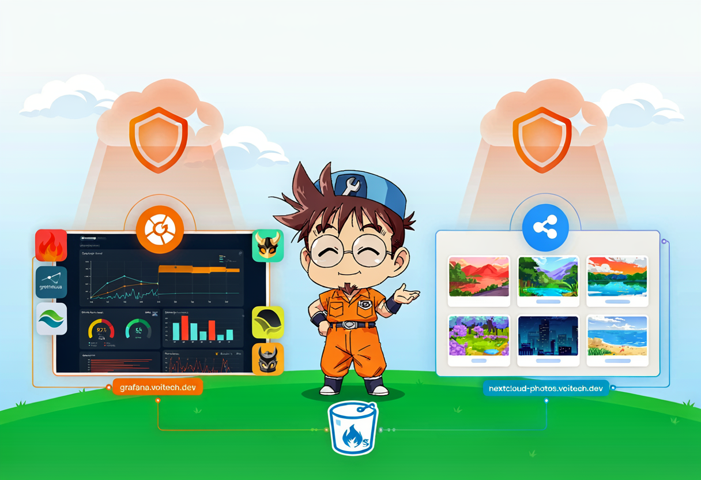
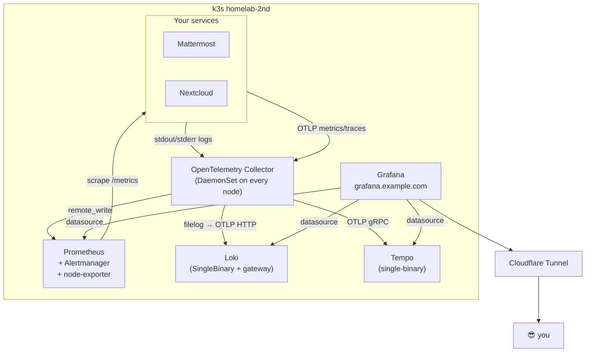
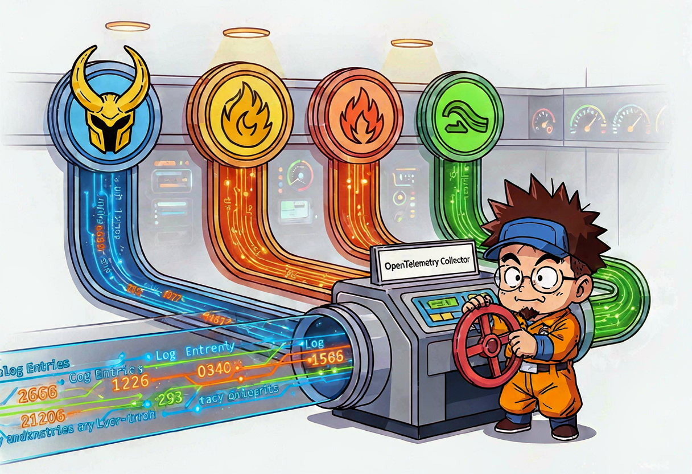
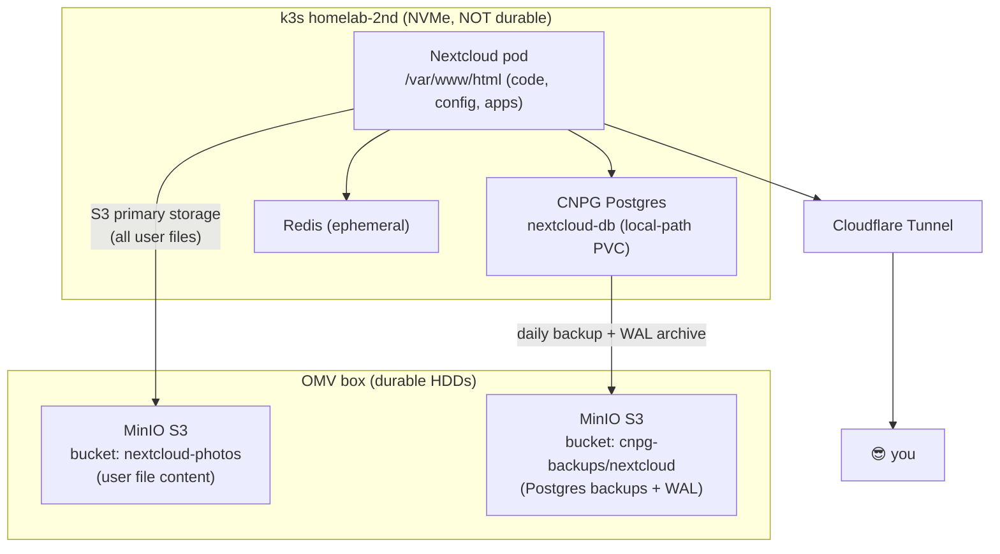
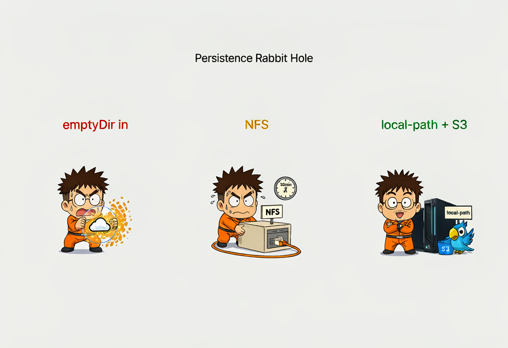
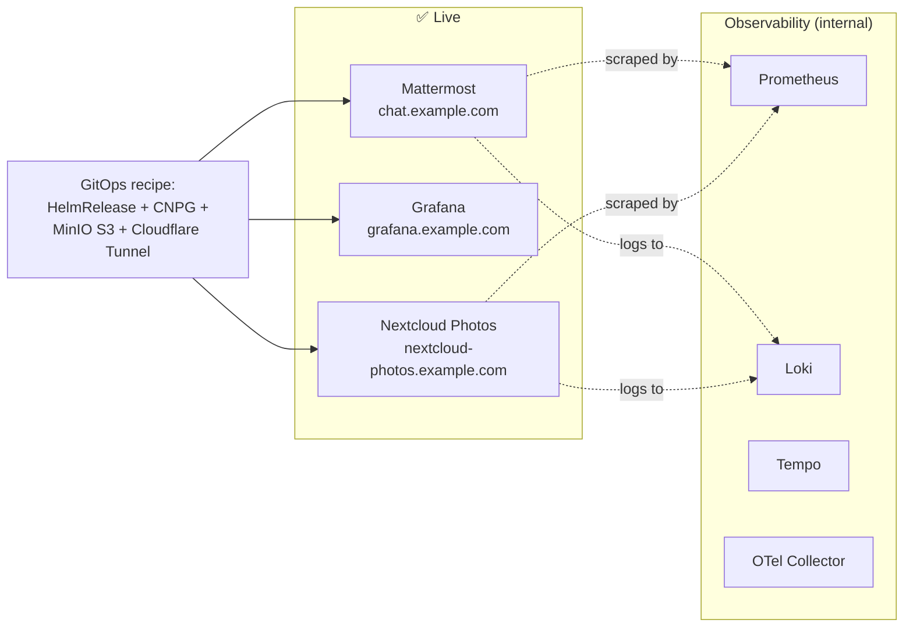

## Two services, one Saturday 🎸

So in the last post I got Mattermost live at `chat.example.com` and declared the GitOps recipe proven. The recipe is: HelmRelease + CNPG Postgres + MinIO S3 + dedicated Cloudflare Tunnel. If you can follow that pattern once, you can follow it ten times.

This weekend I followed it twice. On the same day. Because apparently I don't touch grass on Saturdays 😅

Two things landed:

1. **The LGTM observability stack** — Grafana, Prometheus, Loki, Tempo, and an OpenTelemetry Collector. So the cluster can finally see itself. No more flying blind like on `homelab.one`.
2. **Nextcloud Photos** at `nextcloud-photos.example.com` — a self-hosted Google Photos replacement. Because Google already has enough of my data, thank you very much.

Both follow the same recipe, both are deployed through Flux from the public `gulasz101/homelab-2nd` repo, and both had their share of "what the hell is happening" moments. Let me walk through each.

## Part 1: LGTM — the homelab gets eyes 👀

### Why even bother

On `homelab.one` I ran services without monitoring. It was fine until it wasn't. When something broke, I was SSH-ing into boxes and reading raw logs like some kind of archaeologist. This time around, the Supreme Leader (that's me, talking about myself in third person — it's a whole thing) declared: **no new service goes live until it's observable**.

{: .prompt-info }
New homelab policy: every service must have logs in Loki, metrics in Prometheus, and — where it makes sense — traces in Tempo. If it's not in Grafana, it doesn't exist.

LGTM stands for **L**oki, **G**rafana, **T**empo, **M**etrics (Prometheus). Add an OpenTelemetry Collector as the plumbing and you have a full observability stack. Here's how it fits together:



### The OpenTelemetry Collector — the plumbing

The Collector runs as a DaemonSet — one pod per node. It reads container logs from `/var/log/pods`, enriches them with Kubernetes metadata (namespace, pod, container names), and ships them to Loki via the native OTLP HTTP endpoint. It also accepts OTLP metrics and traces from apps and forwards them to Prometheus (remote write) and Tempo.



Here's the real HelmRelease from the repo, with the pipeline config that wires everything together:

```yaml
# infrastructure/observability/opentelemetry-collector-helm-release.yaml
apiVersion: helm.toolkit.fluxcd.io/v2
kind: HelmRelease
metadata:
  name: opentelemetry-collector
  namespace: observability
spec:
  interval: 1h
  chart:
    spec:
      chart: opentelemetry-collector
      version: ">=0.104.0"
      sourceRef:
        kind: HelmRepository
        name: open-telemetry
        namespace: flux-system
  values:
    mode: daemonset
    image:
      repository: ghcr.io/open-telemetry/opentelemetry-collector-releases/opentelemetry-collector-contrib
    command:
      name: otelcol-contrib

    presets:
      logsCollection:
        enabled: true
        includeCollectorLogs: false
      kubernetesAttributes:
        enabled: true

    config:
      receivers:
        otlp:
          protocols:
            grpc:
              endpoint: ${env:MY_POD_IP}:4317
            http:
              endpoint: ${env:MY_POD_IP}:4318

      exporters:
        # Loki 3.x supports native OTLP log ingestion at /otlp
        otlphttp/loki:
          endpoint: http://loki-gateway.observability.svc.cluster.local:80/otlp
          tls:
            insecure: true
        otlp/tempo:
          endpoint: tempo.observability.svc.cluster.local:4317
          tls:
            insecure: true
        prometheusremotewrite:
          endpoint: http://prometheus-stack-prometheus.observability.svc.cluster.local:9090/api/v1/write
          tls:
            insecure: true
        debug:
          verbosity: basic

      service:
        pipelines:
          logs:
            receivers: [otlp, filelog]
            processors: [batch, k8sattributes]
            exporters: [otlphttp/loki, debug]
          traces:
            receivers: [otlp]
            processors: [batch, k8sattributes]
            exporters: [otlp/tempo, debug]
          metrics:
            receivers: [otlp]
            processors: [batch, k8sattributes]
            exporters: [prometheusremotewrite, debug]
```

{: .prompt-tip }
The `logsCollection` preset already mounts `/var/log/pods` and `/var/lib/docker/containers`. Do NOT add them again as `extraVolumes` — you'll get a duplicate mount path error and the pod won't start. I learned this the hard way 🤦

### Grafana — the single pane of glass

Grafana runs standalone (not the one bundled with `kube-prometheus-stack`) so I can provision all three datasources cleanly. The datasources are defined directly in the HelmRelease values:

```yaml
# infrastructure/observability/grafana-helm-release.yaml (datasources section)
datasources:
  datasources.yaml:
    apiVersion: 1
    datasources:
      - name: Prometheus
        type: prometheus
        url: http://prometheus-stack-kube-prom-prometheus.observability.svc.cluster.local:9090
        access: proxy
        isDefault: true
        editable: false
      - name: Loki
        type: loki
        url: http://loki-gateway.observability.svc.cluster.local:80
        access: proxy
        editable: false
      - name: Tempo
        type: tempo
        url: http://tempo.observability.svc.cluster.local:3200
        access: proxy
        editable: false
```

Grafana is exposed at `https://grafana.example.com` through its own dedicated Cloudflare Tunnel — same pattern as Mattermost, one tunnel per service. The tunnel token lives in a SOPS-encrypted secret. No cert-manager, no open router ports.

### Problems I hit (aka the useful part)

#### 1. The community Loki chart rendered no Loki pod 😱

First attempt: I used the `grafana-community/loki` chart in `Monolithic` mode. The HelmRelease said `Ready`. But `kubectl get pods` showed only `loki-chunks-cache-0`, `loki-results-cache-0`, and `loki-canary-*`. No actual Loki container. The chart rendered caches and canary but **no StatefulSet for Loki itself**.

Fix: added a dedicated HelmRepository pointing at the upstream `https://grafana.github.io/helm-charts` and switched to `deploymentMode: Monolithic` with `singleBinary.replicas: 1`. Deleted the broken release, let Flux recreate it. Loki came up. 🎉

#### 2. Deprecated `loki` exporter missing from Collector

The OTel Collector complained: `'exporters' unknown type: "loki" for id: "loki"`. The old `loki` exporter is deprecated and removed in recent contrib builds.

Fix: use Loki's native OTLP HTTP endpoint through the gateway — `http://loki-gateway.observability.svc.cluster.local:80/otlp`. That's what you see in the HelmRelease above. No more custom exporter, just standard OTLP HTTP.

#### 3. Grafana `init-chown-data` permission error on a reused PVC

`chown: /var/lib/grafana/pdf: Permission denied`. The init container tries to chown the data directory, but on a reused PVC the permissions don't match.

Fix: `initChownData.enabled: false`. Done.

#### 4. Wrong Prometheus service name in Grafana datasource

Grafana showed "Bad Gateway" for the Prometheus datasource. The service name I had was `prometheus-stack-prometheus`. The real service is `prometheus-stack-kube-prom-prometheus`. Classic Helm naming 🙃

### Verification — it actually works

After all the fixes, here's what's running:

```text
alertmanager-prometheus-stack-kube-prom-alertmanager-0   2/2 Running
cloudflared-grafana-85f8fd4f79-bvtc5                     1/1 Running
grafana-7bc944d46-fgmcs                                  2/2 Running
loki-0                                                   2/2 Running
loki-gateway-6494447f4b-qxk92                            1/1 Running
opentelemetry-collector-agent-zp4gc                      1/1 Running
prometheus-prometheus-stack-kube-prom-prometheus-0       2/2 Running
tempo-0                                                  1/1 Running
```

And logs from **all** namespaces are flowing into Loki:

```bash
curl http://loki-gateway/loki/api/v1/label/k8s_namespace_name/values
# => ["cnpg-system","flux-system","kube-system","mattermost","observability"]
```

A query for `{k8s_namespace_name="mattermost"}` returned live CNPG Postgres logs, including WAL archiver warnings. The homelab has eyes now 😎

{: .prompt-warning }
If you log into Grafana and go to **Drilldown → Logs** and see "No logs volume available" — don't panic. The histogram panel just hasn't loaded yet. The log lines are below it. Or use the classic **Explore** path: select the Loki datasource, query `{k8s_namespace_name="mattermost"}`, set time range to Last 1 hour, hit Run query. Logs appear immediately.

## Part 2: Nextcloud Photos — escaping Google 📸

### The plan

Google Photos has had my pictures since 2014. That's twelve years of photos living on someone else's server, subject to someone else's policy changes. Time to fix that.

The plan: deploy Nextcloud on `homelab-2nd`, use it as a self-hosted Google Photos replacement, store all user files on MinIO S3 (on the OMV box), back up the Postgres to S3 as well, and expose it at `https://nextcloud-photos.example.com` through — you guessed it — a dedicated Cloudflare Tunnel.

{: .prompt-info }
The hostname is `nextcloud-photos.example.com`, not just `photos.example.com`. The Supreme Leader decided `photos` is too generic — more photo services may come in the future. Naming things is hard.

### Storage architecture

This took three iterations to get right. Here's the final architecture:



The key decision: **Nextcloud file content goes to MinIO S3 primary storage**, not to local disk. The local NVMe only holds code, config, apps, and thumbnails. If `homelab-2nd` explodes tomorrow, the photos are still on the OMV box in MinIO.

### The HelmRelease — S3 primary storage

Here's the real HelmRelease, showing the S3 objectStore config that makes Nextcloud stream all uploads to MinIO:

```yaml
# apps/nextcloud/nextcloud-helm-release.yaml (key sections)
spec:
  install:
    timeout: 30m    # first install rsyncs ~500MB to the volume
  upgrade:
    timeout: 30m
  values:
    nextcloud:
      host: nextcloud-photos.example.com
      existingSecret:
        enabled: true
        secretName: nextcloud-admin-credentials
        usernameKey: nextcloud-username
        passwordKey: nextcloud-password

      # S3 primary storage on OMV MinIO. The chart translates this into
      # OBJECTSTORE_S3_* env vars, which the Nextcloud entrypoint writes
      # into config.php as objectstore => S3 on first install.
      objectStore:
        s3:
          enabled: true
          existingSecret: nextcloud-minio-creds
          secretKeys:
            accessKey: accessKeyId
            secretKey: secretAccessKey
          host: nas.example.com
          port: 9000
          ssl: false
          usePathStyle: true
          region: us-east-1
          bucket: nextcloud-photos
          autoCreate: false
          legacyAuth: false

    # External Postgres via CNPG
    externalDatabase:
      enabled: true
      type: postgresql
      host: nextcloud-db-rw.nextcloud.svc.cluster.local:5432
      database: nextcloud
      existingSecret:
        enabled: true
        secretName: nextcloud-db-creds

    # Persistence: whole root on NFS PVC, data dir on separate NFS PVC
    persistence:
      enabled: true
      existingClaim: nextcloud-html
      nextcloudData:
        enabled: true
        existingClaim: nextcloud-data

    # PHP tuning for large photo/video uploads
    phpConfigs:
      uploads.ini: |-
        upload_max_filesize=1G
        post_max_size=1G
        max_execution_time=300
        memory_limit=1024M
```

### The database — CNPG with MinIO backups

Same pattern as Mattermost: a CloudNativePG `Cluster` running on local-path NVMe for speed, with daily backups and WAL archiving to OMV MinIO:

```yaml
# apps/nextcloud/postgres-cluster.yaml
apiVersion: postgresql.cnpg.io/v1
kind: Cluster
metadata:
  name: nextcloud-db
  namespace: nextcloud
spec:
  instances: 1
  imageName: ghcr.io/cloudnative-pg/postgresql:16-minimal-trixie

  postgresql:
    parameters:
      max_connections: "200"
      shared_buffers: "512MB"
      effective_cache_size: "1GB"

  bootstrap:
    initdb:
      database: nextcloud
      owner: nextcloud
      secret:
        name: nextcloud-db-credentials

  # Fast local-path for the live DB — NOT durable, that's what backups are for
  storage:
    storageClass: local-path
    size: 20Gi

  # Backups + WAL archiving to OMV MinIO S3
  backup:
    barmanObjectStore:
      destinationPath: s3://cnpg-backups/nextcloud/
      endpointURL: http://nas.example.com:9000
      s3Credentials:
        accessKeyId:
          name: nextcloud-backup-creds
          key: ACCESS_KEY_ID
        secretAccessKey:
          name: nextcloud-backup-creds
          key: ACCESS_SECRET_KEY
      data:
        compression: gzip
    retentionPolicy: "30d"
```

And a daily scheduled backup at 3 AM:

```yaml
# apps/nextcloud/scheduled-backup.yaml
apiVersion: postgresql.cnpg.io/v1
kind: ScheduledBackup
metadata:
  name: nextcloud-db-daily
  namespace: nextcloud
spec:
  schedule: "0 3 * * *"
  backupOwnerReference: self
  cluster:
    name: nextcloud-db
```

### The persistence rabbit hole 🐇

This is where things got spicy. Three attempts to get Nextcloud persistence right:



The first deployment used `emptyDir` for `/var/www/html` with subpaths for `config`, `data`, etc. Problem: every pod restart wiped the install state. `config.php` didn't have `'installed' => true`. WebDAV returned `302` redirects to the login page. Classic amnesia.

{: .prompt-danger }
The Nextcloud Helm chart expects `extraVolumes`/`extraVolumeMounts` under `nextcloud:`, NOT at the top level of `spec.values`. If you put them at the top level, the chart silently ignores them and your pod runs on `emptyDir`. This is Pitfall 40 in my homelab-gitops skill. I hit it so you don't have to.

**Fix attempt 1:** Mount the whole `/var/www/html` root from an OMV NFS PVC (`nextcloud-html`, 20 Gi) and `/var/www/html/data` from a separate NFS PVC (`nextcloud-data`, 200 Gi). This worked but pod startup was slow — the Nextcloud Docker entrypoint rsyncs ~500 MB of code to the NFS volume on every start. Helm timeout at 10 minutes wasn't enough.

**Fix attempt 2:** Bump Helm install/upgrade timeout to `30m`. Relax all probes (`initialDelaySeconds: 600` on liveness, `300` on readiness, `120` on startup). This worked. Pod takes a while on first start but survives.

**Final fix (the one actually deployed now):** The Supreme Leader clarified that "no NFS" meant "no NFS for user photo storage", not "no NFS for Nextcloud runtime state". So the runtime root went back to local-path PVC (`nextcloud-nextcloud`, 10 Gi) for fast NVMe, and all user file content goes to MinIO S3 primary storage. Best of both worlds — fast startup, durable photos.

### The MinIO key rotation saga

At one point uploads started failing with `SignatureDoesNotMatch`. The old MinIO key was dead — a new one had to be issued and the SOPS secret updated.


Turns out the MinIO service account key (`86YDG...XXXX`) no longer existed in MinIO — it had been rotated during earlier debugging and the SOPS secret still had the old key.

Fix: created a dedicated MinIO user `nextcloud` with a readwrite policy, generated new keys, updated the SOPS-encrypted secret `nextcloud-minio-creds.sops.yaml`, pushed, let Flux reconcile. Uploads worked again.

### Admin password leak — oops 😅

The Nextcloud entrypoint runs `occ maintenance:install` with the admin password passed as a **CLI argument**. Which means it's visible in `ps aux` inside the pod during install. Not great.

Fix: rotated the admin password via SOPS secret update + `occ user:resetpassword --password-from-env` with the password fed through stdin so it never touches the command line:

```bash
echo "$NEW_PW" | kubectl -n nextcloud exec -i deployment/nextcloud -c nextcloud -- \
  bash -c 'read -rs PW; export OC_PASS="$PW"; php /var/www/html/occ user:resetpassword --password-from-env admin'
```

### Final verification

Everything green:

```text
Flux kustomizations: Ready
HelmRelease nextcloud: 9.1.3, Ready=True
Pod nextcloud: 2/2 Running
CNPG nextcloud-db-1: healthy
Redis: Running
Cloudflared pods: 2/2 Running
Public URL https://nextcloud-photos.example.com/status.php: HTTP 200
config.php 'installed' flag: true
config.php objectstore: yes
WebDAV PUT/GET/DELETE test: 201 / 200 / 204, content round-trip OK
MinIO bucket nextcloud-photos contains uploaded objects: yes
Loki logs for {k8s_namespace_name="nextcloud"}: entries returned
```

WebDAV upload round-trip worked, the test object appeared in the MinIO bucket, and deleting it via WebDAV removed it from MinIO. S3 primary storage is real and working.

## The repo state after this weekend

Relevant new files in `github.com/gulasz101/homelab-2nd`:

| Path | What it does |
|------|-------------|
| `infrastructure/observability/prometheus-stack-helm-release.yaml` | kube-prometheus-stack (Grafana disabled) |
| `infrastructure/observability/loki-helm-release.yaml` | Loki SingleBinary + gateway, S3 on MinIO |
| `infrastructure/observability/tempo-helm-release.yaml` | Tempo single-binary, local-path storage |
| `infrastructure/observability/grafana-helm-release.yaml` | Standalone Grafana with LGTM datasources |
| `infrastructure/observability/opentelemetry-collector-helm-release.yaml` | OTel Collector DaemonSet |
| `infrastructure/observability/cloudflared-grafana-deployment.yaml` | Cloudflare Tunnel for grafana.example.com |
| `infrastructure/observability/grafana-admin-credentials.sops.yaml` | SOPS-encrypted Grafana admin password |
| `infrastructure/observability/grafana-tunnel-token.sops.yaml` | SOPS-encrypted Cloudflare tunnel token |
| `apps/nextcloud/nextcloud-helm-release.yaml` | Nextcloud with S3 primary storage |
| `apps/nextcloud/postgres-cluster.yaml` | CNPG Postgres + MinIO backups |
| `apps/nextcloud/scheduled-backup.yaml` | Daily 3 AM backup schedule |
| `apps/nextcloud/nextcloud-minio-creds.sops.yaml` | SOPS-encrypted MinIO credentials |
| `apps/nextcloud/nextcloud-cloudflare-token.sops.yaml` | SOPS-encrypted Cloudflare tunnel token |
| `apps/nextcloud/cloudflared-deployment.yaml` | Cloudflare Tunnel for nextcloud-photos.example.com |

All secrets are SOPS-encrypted with age. The repo is public. Zero plaintext credentials. That's the whole point.

## What's running now



Three public services, all behind Cloudflare Tunnels, all observable in Grafana. Not bad for a weekend 😎

## Lessons learned (the condensed version)

1. **Read the chart's values.yaml before fighting it.** The `extraVolumes` placement issue, the `loki` exporter deprecation, the service name mismatch — all would've been 5-minute fixes instead of 30-minute debugging sessions if I'd read the actual chart defaults first.

2. **`emptyDir` is not persistence.** It's a RAM disk that dies on pod restart. If your app stores install state, it needs a real PVC. Shocking, I know.

3. **SOPS secrets with wrong keys = silent failure.** The MinIO key rotation broke uploads silently. Flux happily reconciled a secret with a stale key. Always verify the actual credentials, not just that the secret exists.

4. **Admin passwords in CLI args are visible in `ps aux`.** Rotate them. Feed the new one through stdin.

5. **One Cloudflare Tunnel per service is the way.** Grafana, Mattermost, Nextcloud — each has its own tunnel. If one tunnel breaks, the others stay up. Isolation is worth the extra setup.

6. **Every service must be observable.** If it's not in Grafana, it doesn't exist. This is now policy, not just a good idea.

## What's next

The observability stack needs real dashboards — I have the system-load and GPU power dashboards committed, but there's room for a proper cluster health overview. And Nextcloud still needs the **Memories** app for the actual Google-Photos-like experience (map view, timeline, face recognition). That's a follow-up.

After that: the LLM hub. LiteLLM + OpenWebUI. Because what's a homelab without a local LLM setup that nobody uses? 😅

Repo is here if you want to follow along: [github.com/gulasz101/homelab-2nd](https://github.com/gulasz101/homelab-2nd)

---

*This post was AI-assisted — the blog post and illustrations were crafted with help from Hermes Agent running local models on the homelab itself. I made the engineering decisions; the agent helped with the writing and art. 🤖✨*

Cheers! 🎸