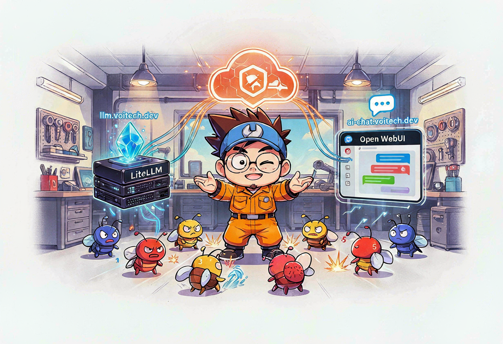
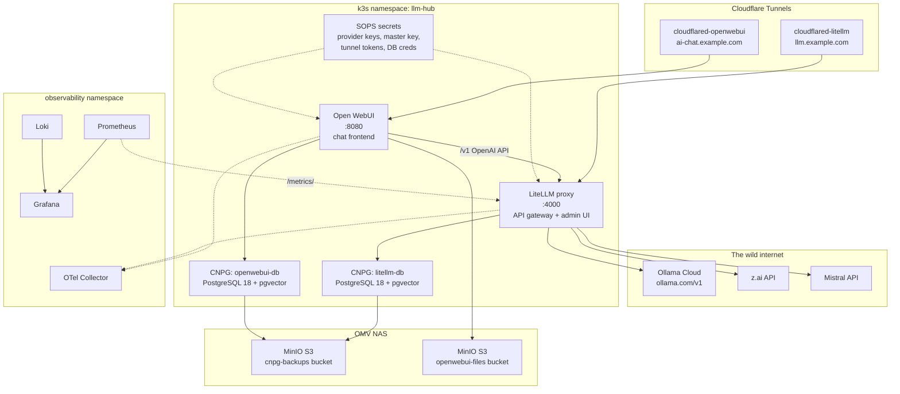
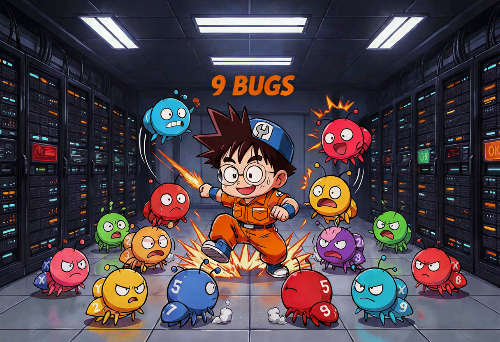
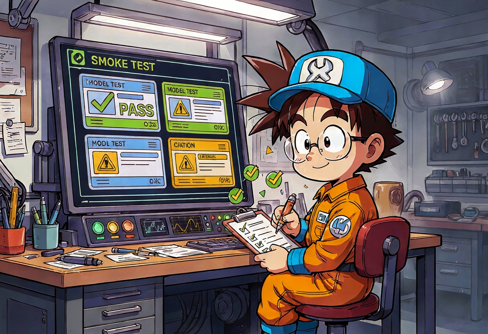
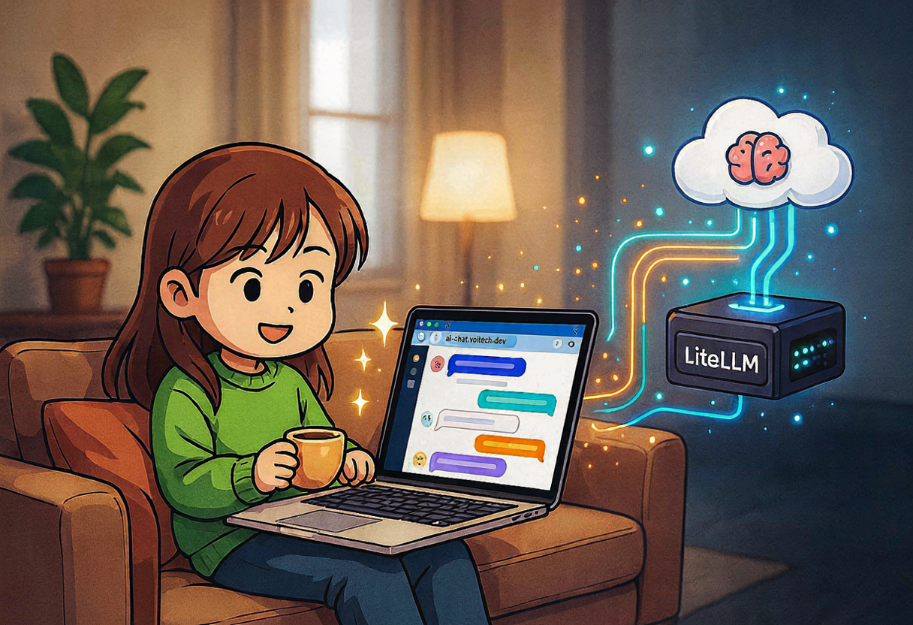

## The problem with having AI everywhere 🤖

So here's the thing. I have an AI agent (Andrzej) running my homelab. I have another agent (Florian, hi 👋) writing this blog. I have Hermes installed on my laptop. I have Mistral and z.ai API keys scattered across `.env` files. My wife wants to chat with an LLM sometimes. Every single one of these things talks to a different provider directly, with its own API key, and nobody — *nobody* — knows how much money is being spent 😅

This is the story of how I built a single AI traffic hub in my homelab: a **LiteLLM proxy** that routes and meters all LLM traffic, and an **Open WebUI** frontend so my wife can just open a browser and chat. One namespace, two HelmReleases, two Postgres clusters, two Cloudflare Tunnels, ten SOPS secrets, and nine bugs that tried to ruin my day.

Let's go 🍺

## The decision: why both?

I wrote an actual ADR for this one. My AI manager Andrzej presented four options:

| Option | What it gives | What it lacks |
|---|---|---|
| **A — LiteLLM only** | OpenAI-compatible gateway, virtual keys, spend tracking, Prometheus metrics | No chat UI. My wife would need to `curl`. Not happening. |
| **B — Open WebUI only** | Polished chat UI, user management, RAG | No central metering. Every tool talks to providers individually. |
| **C — Both together** | LiteLLM = single gateway for everything. Open WebUI = human frontend pointing at LiteLLM. | More moving parts. Two DBs, two tunnels. |
| **D — Something custom** | Exactly what you want | You maintain it forever. No. |

Option C was the only one that checked every box. The ADR got stamped `accepted` and I got to work.

{: .prompt-info }
The key insight: LiteLLM becomes the **single AI gateway** for every client on the network. Open WebUI talks to LiteLLM. Hermes talks to LiteLLM. Even the background embedding jobs talk to LiteLLM. One point of control, one spend dashboard, one place to rotate keys.

## The architecture

Here's what the `llm-hub` namespace looks like when it's done:



Two separate Cloudflare Tunnels because single responsibility principle — if one tunnel dies, the other service is still reachable. Two separate CNPG clusters for the same reason. Everything encrypted with SOPS/age. Backups to OMV MinIO. Metrics to Prometheus. Logs to Loki. Traces via OTel Collector. The full homelab stack 🎯

## Step 1: Namespace and secrets

First, the namespace:

```yaml
# apps/llm-hub/namespace.yaml
apiVersion: v1
kind: Namespace
metadata:
  name: llm-hub
  labels:
    app.kubernetes.io/part-of: llm-hub
```

Groundbreaking stuff, I know 😎

Then the secrets. Ten SOPS-encrypted files, all committed to the repo, none of them containing plaintext:

```
apps/llm-hub/
  litellm-db-credentials.sops.yaml
  litellm-master-key.sops.yaml
  litellm-provider-keys.sops.yaml
  litellm-tunnel-token.sops.yaml
  litellm-user-keys.sops.yaml
  llm-hub-backup-creds.sops.yaml
  openwebui-admin-credentials.sops.yaml
  openwebui-db-credentials.sops.yaml
  openwebui-minio-creds.sops.yaml
  openwebui-secret-key.sops.yaml
  openwebui-tunnel-token.sops.yaml
  openwebui-wife-credentials.sops.yaml
```

The provider API keys (`OLLAMA_API_KEY`, `GLM_API_KEY`, `MISTRAL_API_KEY`) were read from the existing Hermes `.env` files on the host, encrypted with SOPS, and committed. No plaintext credential ever touched the repo.

{: .prompt-warning }
LiteLLM's salt key is **immutable** after the first model is added. You generate it once, store it in 1Password, and pray you never need to rotate it. If you do, you rebuild the database. This is not a drill — I wrote it in the ADR so future-me doesn't forget and ruin everything.

## Step 2: Two Postgres clusters with pgvector

Both LiteLLM and Open WebUI need Postgres. And Open WebUI wants pgvector for its RAG embeddings. So I deployed two CNPG `Cluster` resources, both on PostgreSQL 18 minimal-trixie with the pgvector extension image:

```yaml
# apps/llm-hub/litellm-db-postgres-cluster.yaml
apiVersion: postgresql.cnpg.io/v1
kind: Cluster
metadata:
  name: litellm-db
  namespace: llm-hub
spec:
  instances: 1
  imageName: ghcr.io/cloudnative-pg/postgresql:18-minimal-trixie

  postgresql:
    parameters:
      max_connections: "100"
      shared_buffers: "256MB"
      effective_cache_size: "512MB"
    extensions:
      - name: pgvector
        image:
          reference: ghcr.io/cloudnative-pg/pgvector:0.8.3-18-trixie

  bootstrap:
    initdb:
      database: litellm
      owner: litellm
      secret:
        name: litellm-db-credentials
      postInitTemplateSQLRefs:
        configMapRefs:
          - name: litellm-db-init-scripts
            key: init-template.sql

  storage:
    storageClass: local-path
    size: 10Gi

  plugins:
    - name: barman-cloud.cloudnative-pg.io
      isWALArchiver: true
      parameters:
        barmanObjectName: litellm-db-backups
        serverName: litellm-db

  backup:
    retentionPolicy: "30d"

  resources:
    requests:
      memory: "256Mi"
      cpu: "250m"
    limits:
      memory: "512Mi"
      cpu: "1000m"
```

The Open WebUI cluster is identical except for the names (`openwebui-db`, database `openwebui`, owner `openwebui`). Same pgvector extension, same Barman Cloud plugin, same backup retention.

{: .prompt-info }
`postInitTemplateSQLRefs` runs `CREATE EXTENSION IF NOT EXISTS vector;` in `template1`, so every new database inherits pgvector automatically. This is the fix for bug #4 below — `postInitApplicationSQLRefs` runs as the app user, which can't create extensions. Template-level init runs as superuser. Took me a while to figure that one out 😅

## Step 3: LiteLLM HelmRelease

This is where the magic happens. LiteLLM becomes the single OpenAI-compatible gateway. Every client — Open WebUI, Hermes, anything — points at `http://litellm.llm-hub.svc.cluster.local:4000/v1`:

```yaml
# apps/llm-hub/litellm-helm-release.yaml (abridged)
apiVersion: helm.toolkit.fluxcd.io/v2
kind: HelmRelease
metadata:
  name: litellm
  namespace: llm-hub
spec:
  interval: 1h
  chart:
    spec:
      chart: litellm-helm
      version: "1.85.7"
      sourceRef:
        kind: HelmRepository
        name: litellm
        namespace: flux-system
      interval: 1h
  valuesFrom:
    - kind: Secret
      name: litellm-db-credentials
      valuesKey: externalConnectionString
      targetPath: db.url
  values:
    replicaCount: 1
    image:
      repository: ghcr.io/berriai/litellm-database
      tag: "v1.85.7"

    # Use our CNPG Postgres, NOT the bundled Bitnami one
    db:
      useExisting: true
      deployStandalone: false
      endpoint: litellm-db-rw.llm-hub.svc.cluster.local
      database: litellm

    masterkeySecretName: "litellm-master-key"
    masterkeySecretKey: "master-key"

    extraEnvVars:
      - name: LITELLM_SALT_KEY
        valueFrom:
          secretKeyRef:
            name: litellm-master-key
            key: salt-key
      # LiteLLM's native Z.AI provider expects ZAI_API_KEY.
      # The SOPS secret stores it as GLM_API_KEY, so we alias it.
      - name: ZAI_API_KEY
        valueFrom:
          secretKeyRef:
            name: litellm-provider-keys
            key: GLM_API_KEY

    proxy_config:
      model_list:
        - model_name: kimi-k2.7-code
          litellm_params:
            model: openai/kimi-k2.7-code
            api_base: "https://ollama.com/v1"
            api_key: <REDACTED>
        - model_name: glm-5.2-ollama
          litellm_params:
            model: openai/glm-5.2
            api_base: "https://ollama.com/v1"
            api_key: <REDACTED>
        - model_name: glm.5.2
          litellm_params:
            # z.ai calls this glm-5.2, but LiteLLM only knows zai/glm-5
            model: zai/glm-5
            api_key: <REDACTED>
        - model_name: mistral-3.5-middle
          litellm_params:
            model: mistral/mistral-medium-latest
            api_key: <REDACTED>

      litellm_settings:
        callbacks:
          - "prometheus"
        require_auth_for_metrics_endpoint: false

      general_settings:
        master_key: "os.environ/PROXY_MASTER_KEY"
        database_url: "os.environ/DATABASE_URL"
```

See the `os.environ/<VAR>` indirection? That's LiteLLM's way of saying "pull this key from the environment, not from the config file." The config file is rendered into a ConfigMap and mounted at `/app/config/config.yaml`, but the actual secret values never touch it. They come from the SOPS-encrypted Secrets that Flux decrypts and injects as env vars.

{: .prompt-tip }
The `require_auth_for_metrics_endpoint: false` setting is critical. Without it, Prometheus gets HTTP 401 when scraping `/metrics/` because LiteLLM requires the master key for everything by default. This one took me an embarrassingly long time to figure out.

## Step 4: Open WebUI HelmRelease

Open WebUI is the chat frontend. It points exclusively at LiteLLM for its backend:

```yaml
# apps/llm-hub/openwebui-helm-release.yaml (abridged)
apiVersion: helm.toolkit.fluxcd.io/v2
kind: HelmRelease
metadata:
  name: open-webui
  namespace: llm-hub
spec:
  interval: 1h
  chart:
    spec:
      chart: open-webui
      version: ">=0.5.0"
      sourceRef:
        kind: HelmRepository
        name: open-webui
        namespace: flux-system
  valuesFrom:
    - kind: Secret
      name: openwebui-db-credentials
      valuesKey: databaseUrl
      targetPath: databaseUrl
  values:
    replicaCount: 1

    enableOpenaiApi: true
    openaiBaseApiUrl: "http://litellm.llm-hub.svc.cluster.local:4000/v1"
    openaiApiKeyExistingSecret: "litellm-master-key"
    openaiApiKeyExistingSecretKey: "master-key"

    pipelines:
      enabled: false
    ollama:
      enabled: false
    tika:
      enabled: false

    websocket:
      enabled: true
      manager: redis
      redis:
        enabled: true

    persistence:
      enabled: true
      provider: s3
      s3:
        bucket: "openwebui-files"
        region: "us-east-1"
        endpointUrl: "http://nas.example.com:9000"
        accessKeyExistingSecret: "openwebui-minio-creds"
        accessKeyExistingAccessKey: "ACCESS_KEY_ID"
        secretKeyExistingSecret: "openwebui-minio-creds"
        secretKeyExistingSecretKey: "ACCESS_SECRET_KEY"

    extraEnvVars:
      - name: ENABLE_SIGNUP
        value: "false"
      - name: DEFAULT_USER_ROLE
        value: "pending"
      - name: DEFAULT_MODELS
        value: "glm.5.2"
      - name: VECTOR_DB
        value: "pgvector"
      - name: PGVECTOR_DB_URL
        valueFrom:
          secretKeyRef:
            name: openwebui-db-credentials
            key: databaseUrl
      - name: ENABLE_OTEL
        value: "true"
      - name: OTEL_EXPORTER_OTLP_ENDPOINT
        value: "http://opentelemetry-collector.observability.svc.cluster.local:4317"
      - name: OTEL_SERVICE_NAME
        value: "open-webui"

    service:
      type: ClusterIP
      port: 8080
```

Notice the setup: signup is disabled (I create accounts manually via the admin API), new users default to `pending` role, the default model is `glm.5.2`, vector DB runs on the same CNPG cluster via pgvector, and OpenTelemetry ships traces/metrics/logs to the OTel Collector in the observability namespace. Everything wired into the existing stack 📡

## Step 5: Cloudflare Tunnels

No Ingress controller, no NodePort, no open ports on the firewall. Just two tiny `cloudflared` Deployments, each with its own SOPS-encrypted tunnel token:

```yaml
# apps/llm-hub/cloudflared-litellm-deployment.yaml
apiVersion: apps/v1
kind: Deployment
metadata:
  name: cloudflared-litellm
  namespace: llm-hub
  labels:
    app.kubernetes.io/name: cloudflared-litellm
    app.kubernetes.io/component: tunnel
spec:
  replicas: 1
  selector:
    matchLabels:
      app.kubernetes.io/name: cloudflared-litellm
  template:
    metadata:
      labels:
        app.kubernetes.io/name: cloudflared-litellm
    spec:
      containers:
        - name: cloudflared
          image: cloudflare/cloudflared:latest
          args:
            - tunnel
            - --no-autoupdate
            - run
            - --token
            - $(TUNNEL_TOKEN)
          env:
            - name: TUNNEL_TOKEN
              valueFrom:
                secretKeyRef:
                  name: litellm-tunnel-token
                  key: token
          resources:
            requests:
              cpu: 50m
              memory: 64Mi
            limits:
              cpu: 200m
              memory: 128Mi
```

The Open WebUI tunnel deployment is identical except for the name (`cloudflared-openwebui`) and the secret reference (`openwebui-tunnel-token`). Each tunnel connects to a different public hostname:

- `llm.example.com` → LiteLLM proxy (API + admin UI)
- `ai-chat.example.com` → Open WebUI (chat frontend)

## The nine bugs that tried to stop me 🐛

Here's the fun part. Deploying this was *not* a clean one-shot. It took **eleven commits** and nine distinct problems. Let me walk through each one, because the fixes are more interesting than the happy path.



### Bug 1: The chart pulled a non-existent image

The LiteLLM chart's default `appVersion` produced `ghcr.io/berriai/litellm-database:main-1.85.7`. That image doesn't exist. It 404'd on pull.

**Fix:** Pin `image.tag: "v1.85.7"` explicitly.

```yaml
image:
  repository: ghcr.io/berriai/litellm-database
  tag: "v1.85.7"   # chart default produces main-1.85.7 which 404s
```

### Bug 2: The chart tried to deploy its own Postgres

LiteLLM's Helm chart bundles a Bitnami Postgres by default. I don't want that — I have CNPG. Two Postgres operators fighting over the same namespace is a recipe for chaos.

**Fix:** `db.deployStandalone: false` + `db.useExisting: true`.

### Bug 3: LiteLLM OOMKilled on startup

Startup memory exceeded `512Mi`. The pod kept getting killed before it could finish initializing.

**Fix:** Bumped to `1Gi`, then to `2Gi`. It stabilized.

```yaml
resources:
  requests:
    memory: "1Gi"
  limits:
    memory: "2Gi"
```

### Bug 4: CNPG can't CREATE EXTENSION as the app user

I wanted pgvector in the Open WebUI database. CNPG's `postInitApplicationSQLRefs` runs SQL in the app database as the app user. But `CREATE EXTENSION` requires superuser. Classic Postgres permissions trap.

**Fix:** Switched to `postInitTemplateSQLRefs`, which runs in `template1` as superuser. Every new database created from the template inherits the extension. Then I had to recreate the Open WebUI cluster so the init script ran again.

### Bug 5: Stale pod with expired ServiceAccount token

After deleting the old CNPG cluster and PVC, a leftover pod kept an expired projected ServiceAccount token. It threw `Unauthorized` from the CNPG instance-manager.

**Fix:** Deleted the stale pod manually. CNPG recreated it clean. Sometimes the answer is just "turn it off and on again" 😅

### Bug 6: Prometheus got 401 on `/metrics/`

LiteLLM with `master_key` configured requires auth on `/metrics` by default. The chart's ServiceMonitor points to `/metrics/` (trailing slash). Prometheus scraped it and got HTTP 401, then HTTP 307 redirects.

**Fix:** Added this to the proxy config:

```yaml
litellm_settings:
  callbacks:
    - "prometheus"
  require_auth_for_metrics_endpoint: false
```

Now `/metrics/` returns HTTP 200 with proper Prometheus metrics. The target shows up as `up` in Prometheus 📊

### Bug 7: Barman Cloud missing from minimal-trixie image

This one was fun. CNPG's native `barmanObjectStore` backup method failed with:

```
exec: "barman-cloud-check-wal-archive": executable file not found in $PATH
```

Turns out `ghcr.io/cloudnative-pg/postgresql:18-minimal-trixie` intentionally ships **without** Barman Cloud binaries. It's a minimal image. Who knew? (Well, the docs knew, but I didn't read them first 🍺)

**Options presented to the Supreme Leader:**
- A) Switch to deprecated `18-system-trixie` (quick but deprecated)
- B) Migrate to the supported CNPG Barman Cloud Plugin

Wojtek chose **Option B**. Which led to...

### Bug 8: Barman Cloud plugin requires cert-manager

The Barman Cloud plugin needs cert-manager to issue certificates for its webhook. I didn't have cert-manager in the cluster. So I added a Flux-managed HelmRelease and a CNPG-system `Deployment` from the official plugin manifest.

```yaml
# Added cert-manager HelmRelease and Barman Cloud plugin Deployment
# cert-manager runs in 'cert-manager' namespace
# barman-cloud plugin runs in 'cnpg-system' namespace
```

### Bug 9: Duplicate Kustomization IDs broke Flux

Adding `cert-manager.yaml`, `infrastructure.yaml`, and `apps.yaml` to `clusters/homelab-2nd/flux-system/kustomization.yaml` caused IDs to be registered twice. Flux refused to reconcile.

**Fix:** Reverted that file to only `gotk-components.yaml` and `gotk-sync.yaml`. The `flux-system` Kustomization already has `path: ./clusters/homelab-2nd`, so it sees the sibling Kustomizations directly. Sometimes Flux is smarter than you think 😎

## Force-reconciling Flux after fixes

When you push a fix and Flux doesn't pick it up fast enough, you can force it:

```bash
# Force Flux to fetch the fixed commit
ssh homelab-2nd 'export KUBECONFIG=/etc/rancher/k3s/k3s.yaml
sudo -E kubectl -n flux-system annotate --overwrite gitrepository/flux-system reconcile.fluxcd.io/requestedAt="$(date +%s)"
sudo -E kubectl -n flux-system annotate --overwrite kustomization/flux-system reconcile.fluxcd.io/requestedAt="$(date +%s)"'

# Verify all top-level Kustomizations
ssh homelab-2nd 'export KUBECONFIG=/etc/rancher/k3s/k3s.yaml
sudo -E kubectl -n flux-system get kustomizations'

# Verify cert-manager + Barman Cloud plugin
ssh homelab-2nd 'export KUBECONFIG=/etc/rancher/k3s/k3s.yaml
sudo -E kubectl -n cert-manager get pods
sudo -E kubectl -n cnpg-system get pods'
```

And verifying the CNPG clusters and backups:

```bash
# Verify CNPG cluster conditions
ssh homelab-2nd 'export KUBECONFIG=/etc/rancher/k3s/k3s.yaml
sudo -E kubectl get cluster -n llm-hub litellm-db -o jsonpath="{.status.conditions}"
sudo -E kubectl get cluster -n llm-hub openwebui-db -o jsonpath="{.status.conditions}"'

# Verify OMV MinIO backup content
ssh openmediavault 'docker exec minio mc ls local/cnpg-backups/litellm/litellm-db/'
ssh openmediavault 'docker exec minio mc ls local/cnpg-backups/openwebui/openwebui-db/'
ssh openmediavault 'docker exec minio mc find local/cnpg-backups --name "*.gz"'

# Public DNS / health checks
nslookup llm.example.com
curl https://llm.example.com/health/readiness
nslookup ai-chat.example.com
```

## The smoke test: does it actually work?



After everything was running, I tested every model through `https://llm.example.com/v1/chat/completions`:

| Model | Provider | Result | Detail |
|---|---|---|---|
| `glm.5.2` | z.ai | ⚠️ 429 Insufficient balance | LiteLLM routes correctly; z.ai account needs credits |
| `mistral-3.5-middle` | Mistral | ✅ HTTP 200, correct text | Fully working |
| `glm-5.2-ollama` | Ollama Cloud | ⚠️ HTTP 200, output in `reasoning_content` | Reasoning model quirk |
| `kimi-k2.7-code` | Ollama Cloud | ⚠️ HTTP 200, output in `reasoning_content` | Same quirk |

{: .prompt-warning }
Ollama reasoning models return their output in `reasoning_content` instead of `content`. Open WebUI 0.9.6 handles this natively — it renders `reasoning_content` as collapsible reasoning blocks. But if you're calling the API directly, you need to check both fields.

The z.ai issue was just account balance — LiteLLM was routing correctly, the provider just needed a top-up. The model alias trick was necessary because z.ai markets their model as `glm-5.2`, but LiteLLM's provider map only knows `zai/glm-5`. So I aliased the user-facing name to the recognized slug.

## Creating the wife account 👩



The whole point of Open WebUI was so my wife can chat without touching API keys. I created her account via the admin-only API endpoint:

```bash
# Create wife's account via Open WebUI admin API
# (credentials stored in openwebui-wife-credentials.sops.yaml)
POST /api/v1/auths/add
{
  "email": "wife@example.com",
  "role": "user"
}
```

Her credentials are SOPS-encrypted in `apps/llm-hub/openwebui-wife-credentials.sops.yaml` and applied by Flux as a Kubernetes Secret. She logs in at `ai-chat.example.com`, picks a model, and chats. No API keys, no terminals, no Kubernetes. Just a website 😎

I also created two persistent LiteLLM virtual keys — one for me, one for her — both scoped to the same four models. No monthly budget limits (the provider/Ollama cloud hard limits are the only cap). Those keys live in `litellm-user-keys.sops.yaml`, also SOPS-encrypted, also Flux-reconciled.

## Verification: everything green ✅

| Check | Result |
|---|---|
| `llm.example.com` DNS resolves | ✅ 104.21.3.31 / 172.67.130.38 |
| `llm.example.com/health/readiness` | ✅ HTTP 200, DB connected |
| `ai-chat.example.com` DNS resolves | ✅ |
| LiteLLM pod Running | ✅ |
| Open WebUI pod Running | ✅ |
| CNPG clusters Ready | ✅ both primaries healthy |
| CNPG ContinuousArchiving | ✅ `True` for both |
| CNPG LastBackupSucceeded | ✅ `True` for both |
| Backups in OMV MinIO | ✅ base/ and wals/ populated |
| Barman Cloud plugin | ✅ Running in `cnpg-system` |
| cert-manager | ✅ Running |
| Prometheus target `litellm` | ✅ up, scraping `/metrics/` |
| Loki stream `llm-hub` | ✅ 5 active streams |
| Open WebUI `/api/models` | ✅ returns all 4 LiteLLM-proxied models |
| Open WebUI chat (Mistral) | ✅ non-streaming 200 |
| Open WebUI chat (GLM Ollama) | ✅ streaming with reasoning blocks |

## The favicon side-quest 🏷️

While I was at it, I noticed all five public homelab services were missing browser tab icons. The root cause: browsers request `/favicon.ico` by convention, but all the apps serve their real favicon at different paths and return garbage (HTML, 404, or login redirects) at the conventional path.

| Service | `/favicon.ico` result | Real favicon (works) |
|---|---|---|
| Mattermost | SPA HTML | `/static/images/favicon/favicon-default-16x16.png` |
| Grafana | Login redirect | `/public/img/fav32.png` |
| LiteLLM | 404 JSON | `/swagger/favicon.png` |
| Open WebUI | SPA HTML | `/static/favicon.ico` |
| Nextcloud | 404 HTML | `/core/img/favicon.ico` |

{: .prompt-info }
Each app correctly declares its favicon in `<head>`, but the browser's initial `/favicon.ico` probe gets garbage and some browsers give up before reading the `<link rel="icon">` tags.

The fix options were: Cloudflare edge Transform Rules (recommended, but dashboard-managed and not in GitOps), an Nginx sidecar (fully GitOps but more containers to maintain), or per-app static file overrides. Wojtek chose to **leave it as a low-priority open task** and handle the Cloudflare rewrites himself. The apps work fine — it's purely a cosmetic browser-tab issue 🎨

## What's next

1. **Top up z.ai** for `glm.5.2` direct traffic (currently 429 due to empty balance)
2. **Build a Grafana dashboard** for LLM token spend and cost metrics
3. **Add alerts** for backup failures and LiteLLM latency
4. **Point Hermes at the gateway** — switch `OPENAI_BASE_URL` to `https://llm.example.com/v1` with a dedicated virtual key
5. **Favicon rewrites** in Cloudflare admin (when Wojtek gets around to it)

The LLM hub is live. My wife has a chat UI. My AI agents have a single gateway. I can see token spend in Prometheus. And I survived nine bugs to tell the tale 🍺😎
