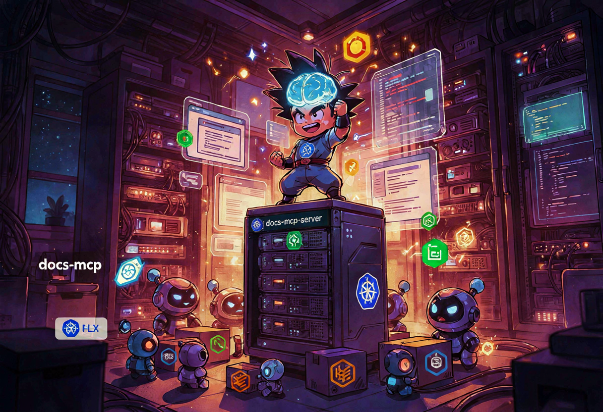
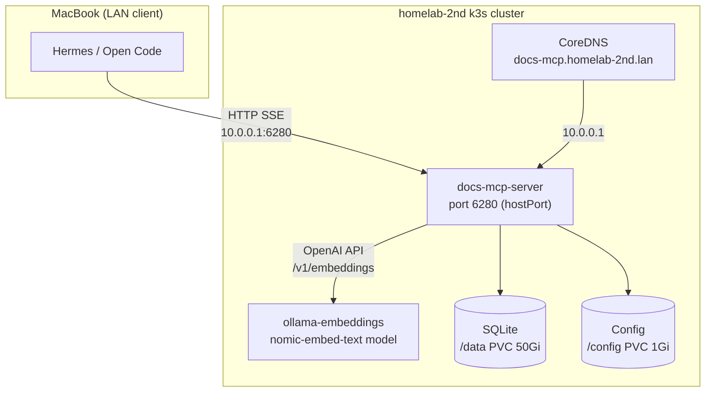
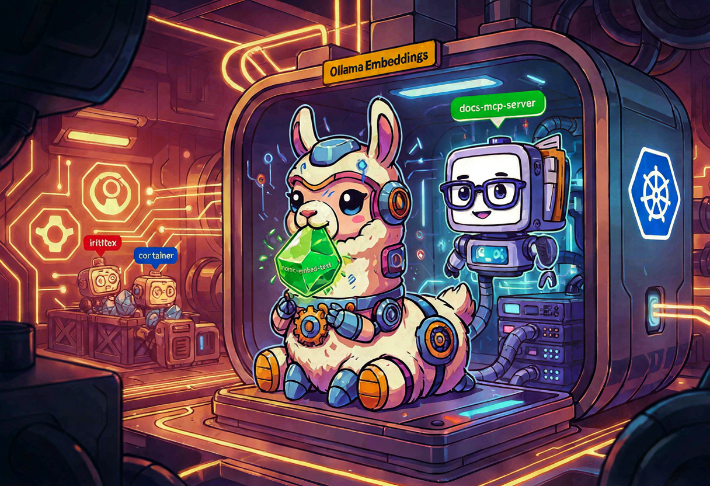
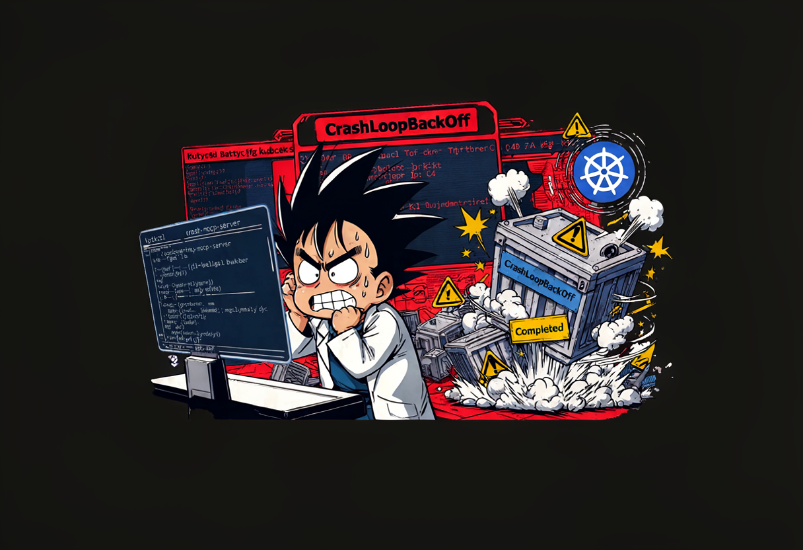
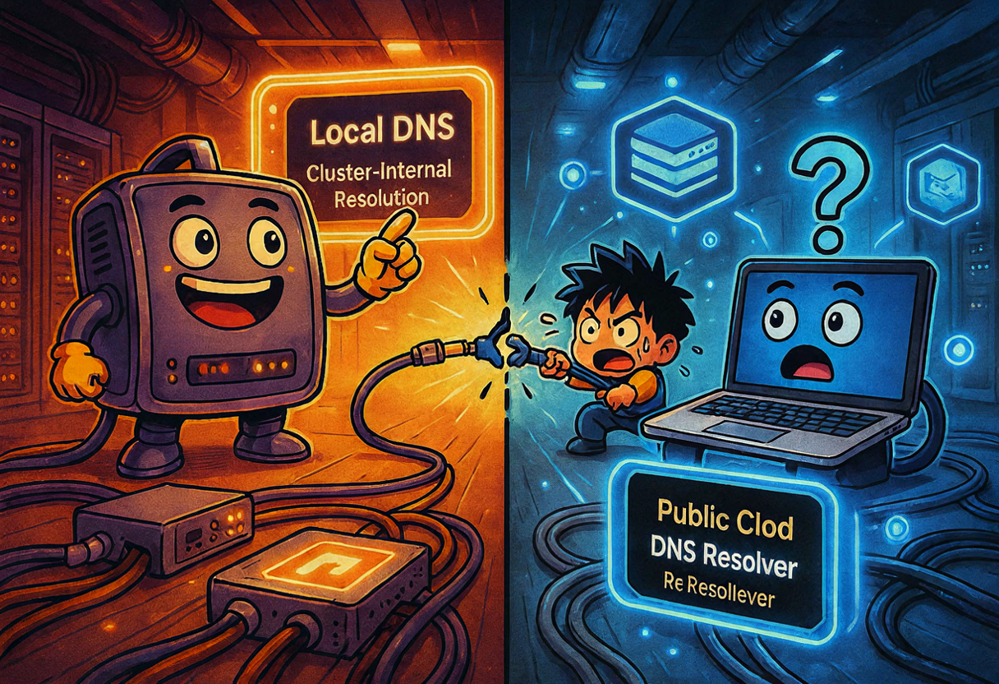

So here's the situation. I have this tool called [`docs-mcp-server`](https://github.com/arabold/docs-mcp-server) — it's an MCP server that indexes documentation libraries (Helm charts, Flux docs, SOPS, whatever you throw at it) and exposes them through an MCP endpoint so my AI agents can search docs without hallucinating APIs that don't exist. Cool concept, right?

The problem: it was running on my M1 Max MacBook Pro. In Docker. With an embedding model. And you know what the M1 Max is supposed to be doing? Running LLMs and Hermes agents. Not babysitting a documentation indexer 😅

On June 26th I decided to fix this: move docs-mcp-server to `homelab-2nd` (my k3s cluster), give it its own Ollama for embeddings, and keep the whole thing local-only — no Cloudflare Tunnel, no public DNS, no Ingress. Just a nice quiet service on the LAN that my agents can talk to.

What followed was an evening of CrashLoopBackOff, ConfigMap disasters, DNS confusion, and a port conflict that reminded me why single-node clusters are both wonderful and terrible. Let me tell you the story 🎸

## What is docs-mcp-server and why offload it?

[docs-mcp-server](https://github.com/arabold/docs-mcp-server) by arabold is an MCP server that can scrape and index documentation from websites, GitHub repos, and local files. It stores everything in a SQLite database and exposes search through an SSE (Server-Sent Events) MCP endpoint. Your AI coding assistant — Cline, Roo Code, Claude Desktop, whatever — connects to it and can suddenly search the official Kubernetes docs instead of guessing what `kubectl` flags exist.

The thing is, running it on the MacBook meant:
- Docker was eating RAM that LLMs needed
- The embedding model (`nomic-embed-text`) was competing for CPU
- If the laptop was asleep, no agent could search docs

The homelab-2nd k3s cluster is always on, always available, and has an NVIDIA GPU sitting there for exactly this kind of thing. So the plan was clear.

## The plan (and the ADR)

I wrote an ADR (Architecture Decision Record) to nail down the decisions before writing any YAML. Here's the thinking:



The key decisions, straight from [ADR-002](https://github.com/arabold/docs-mcp-server):

1. **Local-only**: no Cloudflare Tunnel, no public DNS, no Ingress. Access via `http://10.0.0.1:6280`.
2. **SQLite on `local-path`**: docs-mcp-server only documents SQLite — no Postgres support. Treat the index as rebuildable cache, not durable data.
3. **In-cluster Ollama**: `ollama/ollama` serving `nomic-embed-text` via an OpenAI-compatible API. The embedding model is small (~274 MB) and runs fine on CPU, but we have a GPU so why not.
4. **DNS**: add `docs-mcp.homelab-2nd.lan -> 10.0.0.1` in CoreDNS for cluster-side resolution. Mac clients still need a local `/etc/hosts` entry (more on that later 🤦).

{: .prompt-info }
The ADR also notes that `hostPort` was chosen over `NodePort` because NodePort range is 30000-32767 by default, and we wanted to preserve port 6280 — the default docs-mcp-server port. This decision would come back to bite me, as you'll see.



## Step 1 — Namespace and PVCs

First, the namespace. Everything goes in `docs-mcp`:

```yaml
apiVersion: v1
kind: Namespace
metadata:
  name: docs-mcp
  labels:
    app.kubernetes.io/name: docs-mcp
```

Then two PVCs on `local-path` (the k3s default local storage provisioner). The SQLite index and the runtime config:

```yaml
---
# docs-mcp-data-pvc.yaml — 50Gi for the SQLite index and cached documents
apiVersion: v1
kind: PersistentVolumeClaim
metadata:
  name: docs-mcp-data
  namespace: docs-mcp
spec:
  accessModes:
    - ReadWriteOnce
  storageClassName: local-path
  resources:
    requests:
      storage: 50Gi

---
# docs-mcp-config-pvc.yaml — 1Gi for runtime config
apiVersion: v1
kind: PersistentVolumeClaim
metadata:
  name: docs-mcp-config
  namespace: docs-mcp
spec:
  accessModes:
    - ReadWriteOnce
  storageClassName: local-path
  resources:
    requests:
      storage: 1Gi
```

{: .prompt-warning }
Both PVCs are on `local-path` — that means they live on the node's NVMe drive. If the node burns down, the index is gone. That's fine: docs-mcp-server can rebuild it by re-scraping the source documentation. Durable data lives on OMV MinIO, not here. This is the homelab storage philosophy: rebuildable cache on `local-path`, durable data on NFS/MinIO.

## Step 2 — ConfigMap and SOPS secret

The ConfigMap tells docs-mcp-server which embedding model to use, where to store things, and that telemetry should be off (I don't need anonymous usage data going anywhere):

```yaml
apiVersion: v1
kind: ConfigMap
metadata:
  name: docs-mcp-config
  namespace: docs-mcp
data:
  config.yaml: |
    app:
      storePath: "/data"
      telemetryEnabled: false
      readOnly: false
      embeddingModel: "openai:nomic-embed-text"
    server:
      protocol: http
      host: "0.0.0.0"
      ports:
        default: 6280
        worker: 8080
        mcp: 6280
        web: 6281
    auth:
      enabled: false
    embeddings:
      batchSize: 100
      batchChars: 50000
      requestTimeoutMs: 30000
      initTimeoutMs: 30000
```

Now the fun part: docs-mcp-server talks to Ollama through an OpenAI-compatible API. It expects an `OPENAI_API_KEY` environment variable. Ollama doesn't care about the key — it accepts anything. But to keep consistency with the rest of the repo (where all secrets are SOPS-encrypted), I created a SOPS secret with a fake key:

```yaml
apiVersion: v1
kind: Secret
metadata:
    name: docs-mcp-embedding-key
    namespace: docs-mcp
type: Opaque
stringData:
    openai-api-key: ENC[AES256_GCM,data:XxrKaprb,iv:0u0R+fKv0ehV/ahNRVz8aDVZX5qjKzsqdr/WxuNyvtc=,tag:xr8QEUdo2aQSnZrnM97Wnw==,type:str]
sops:
    age:
        - enc: |
            -----BEGIN AGE ENCRYPTED FILE-----
            YWdlLWVuY3J5cHRpb24ub3JnL3YxCi0+IFgyNTUxOSAyM2pxd1VjbnAxTDBXVHJH
            ...
            -----END AGE ENCRYPTED FILE-----
          recipient: <REDACTED_KEY>
    encrypted_regex: ^(data|stringData)$
    lastmodified: "2026-06-26T21:26:41Z"
    version: 3.13.1
```

Yes, the "API key" is just the string `ollama`. SOPS encrypts it with age. It's a fake key for a fake OpenAI endpoint that doesn't check keys. But at least it's not sitting in plaintext in the repo 😎

## Step 3 — Ollama: the embedding sidecar

This is where it gets interesting. I need an Ollama container running `nomic-embed-text` in the cluster, accessible from docs-mcp-server. The Ollama deployment uses an init container to pull the model before the main container starts:

```yaml
apiVersion: apps/v1
kind: Deployment
metadata:
  name: ollama-embeddings
  namespace: docs-mcp
  labels:
    app.kubernetes.io/name: ollama-embeddings
spec:
  replicas: 1
  selector:
    matchLabels:
      app.kubernetes.io/name: ollama-embeddings
  template:
    metadata:
      labels:
        app.kubernetes.io/name: ollama-embeddings
    spec:
      runtimeClassName: nvidia
      nodeSelector:
        feature.node.kubernetes.io/pci-10de.present: "true"
      tolerations:
        - key: nvidia.com/gpu
          operator: Exists
          effect: NoSchedule
      initContainers:
        - name: pull-model
          image: ollama/ollama:0.3.14
          command:
            - /bin/sh
            - -c
            - |
              set -e
              ollama serve &
              SERVE_PID=$!
              until ollama list >/dev/null 2>&1; do
                echo "Waiting for Ollama API..."
                sleep 1
              done
              if ollama list | grep -q nomic-embed-text; then
                echo "nomic-embed-text already present; skipping pull."
              else
                echo "Pulling nomic-embed-text..."
                ollama pull nomic-embed-text
                echo "Model pulled."
              fi
              kill $SERVE_PID
              wait $SERVE_PID 2>/dev/null || true
          env:
            - name: OLLAMA_HOST
              value: "127.0.0.1:11434"
            - name: HOME
              value: "/root"
          volumeMounts:
            - name: ollama-models
              mountPath: /root/.ollama
          resources:
            requests:
              cpu: 500m
              memory: 1Gi
            limits:
              memory: 4Gi
      containers:
        - name: ollama
          image: ollama/ollama:0.3.14
          ports:
            - name: http
              containerPort: 11434
              protocol: TCP
          env:
            - name: OLLAMA_HOST
              value: "0.0.0.0:11434"
            - name: HOME
              value: "/root"
          volumeMounts:
            - name: ollama-models
              mountPath: /root/.ollama
          resources:
            requests:
              cpu: "2"
              memory: 1Gi
              nvidia.com/gpu: 1
            limits:
              cpu: "4"
              memory: 4Gi
              nvidia.com/gpu: 1
          livenessProbe:
            httpGet:
              path: /
              port: 11434
            initialDelaySeconds: 30
            periodSeconds: 15
          readinessProbe:
            httpGet:
              path: /
              port: 11434
      volumes:
        - name: ollama-models
          persistentVolumeClaim:
            claimName: ollama-models
```

{: .prompt-tip }
The init container is smart about it: it checks if `nomic-embed-text` is already on the PVC before pulling. No need to re-download 274 MB on every pod restart. The model cache lives on a 20Gi `local-path` PVC so it survives pod restarts — just not node rebuilds.

And a ClusterIP service so docs-mcp-server can reach it:

```yaml
apiVersion: v1
kind: Service
metadata:
  name: ollama-embeddings
  namespace: docs-mcp
spec:
  type: ClusterIP
  selector:
    app.kubernetes.io/name: ollama-embeddings
  ports:
    - name: http
      port: 11434
      targetPort: http
      protocol: TCP
```



## Step 4 — The docs-mcp-server deployment

Now the main event. This is the deployment that caused me the most pain:

```yaml
apiVersion: apps/v1
kind: Deployment
metadata:
  name: docs-mcp-server
  namespace: docs-mcp
  labels:
    app.kubernetes.io/name: docs-mcp-server
spec:
  replicas: 1
  selector:
    matchLabels:
      app.kubernetes.io/name: docs-mcp-server
  template:
    metadata:
      labels:
        app.kubernetes.io/name: docs-mcp-server
    spec:
      securityContext:
        fsGroup: 1000
      containers:
        - name: server
          image: ghcr.io/arabold/docs-mcp-server:latest
          imagePullPolicy: IfNotPresent
          ports:
            - name: http
              containerPort: 6280
              hostPort: 6280
              protocol: TCP
          env:
            - name: PORT
              value: "6280"
            - name: HOST
              value: "0.0.0.0"
            - name: DOCS_MCP_STORE_PATH
              value: "/data"
            - name: XDG_CONFIG_HOME
              value: "/config"
            - name: DOCS_MCP_EMBEDDING_MODEL
              value: "openai:nomic-embed-text"
            - name: OPENAI_API_BASE
              value: "http://ollama-embeddings.docs-mcp.svc.cluster.local:11434/v1"
            - name: OPENAI_API_KEY
              valueFrom:
                secretKeyRef:
                  name: docs-mcp-embedding-key
                  key: openai-api-key
            - name: DOCS_MCP_TELEMETRY_ENABLED
              value: "false"
            - name: DOCS_MCP_CONFIG
              value: "/config/docs-mcp-server/config.yaml"
          args:
            - "--protocol"
            - "http"
            - "--host"
            - "0.0.0.0"
            - "--port"
            - "6280"
            - "--config"
            - "/config/docs-mcp-server/config.yaml"
          volumeMounts:
            - name: data
              mountPath: /data
            - name: config
              mountPath: /config
            - name: config-file
              mountPath: /config/docs-mcp-server/config.yaml
              subPath: config.yaml
          resources:
            requests:
              cpu: 500m
              memory: 1Gi
            limits:
              memory: 8Gi
          livenessProbe:
            httpGet:
              path: /
              port: http
            initialDelaySeconds: 30
            periodSeconds: 15
            timeoutSeconds: 5
            failureThreshold: 5
          readinessProbe:
            httpGet:
              path: /
              port: http
            initialDelaySeconds: 10
            periodSeconds: 10
            timeoutSeconds: 5
            failureThreshold: 3
      volumes:
        - name: data
          persistentVolumeClaim:
            claimName: docs-mcp-data
        - name: config
          persistentVolumeClaim:
            claimName: docs-mcp-config
        - name: config-file
          configMap:
            name: docs-mcp-config
```

A ClusterIP service for in-cluster access (though external access goes through the hostPort):

```yaml
apiVersion: v1
kind: Service
metadata:
  name: docs-mcp-server
  namespace: docs-mcp
spec:
  type: ClusterIP
  selector:
    app.kubernetes.io/name: docs-mcp-server
  ports:
    - name: http
      port: 6280
      targetPort: http
      protocol: TCP
```

## Step 5 — CoreDNS

I added a CoreDNS entry so the cluster itself can resolve `docs-mcp.homelab-2nd.lan`:

```yaml
apiVersion: v1
kind: ConfigMap
metadata:
  name: coredns-custom-homelab
  namespace: kube-system
data:
  homelab.server: |
    homelab-2nd.lan:53 {
      errors
      cache 30
      hosts {
        10.0.0.1 docs-mcp.homelab-2nd.lan
        fallthrough
      }
    }
```

{: .prompt-warning }
This CoreDNS entry only helps **cluster-side** DNS. Your Mac is probably using Cloudflare (`1.1.1.1`) or whatever your router hands out via DHCP, and it has no idea what `.homelab-2nd.lan` is. You need either a router-level DNS entry or a local `/etc/hosts` entry on each Mac. I learned this the hard way.

## Commit, push, and let Flux do its thing

With all manifests written, it was time to commit and push:

```bash
cd ~/Projects/homelab-2nd
git add -A
git commit -m "feat(docs-mcp): deploy local docs-mcp-server with Ollama embeddings"
git push origin main

# Force Flux reconciliation
ssh homelab-2nd -o ConnectTimeout=10 'export KUBECONFIG=/etc/rancher/k3s/k3s.yaml; \
  sudo -E kubectl -n flux-system annotate gitrepository flux-system \
    reconcile.fluxcd.io/requestedAt="$(date +%Y-%m-%dT%H:%M:%S%z)" --overwrite; \
  sleep 10; \
  sudo -E kubectl -n flux-system annotate kustomization apps \
    reconcile.fluxcd.io/requestedAt="$(date +%Y-%m-%dT%H:%M:%S%z)" --overwrite'
```

And then... well, then the problems started 😅



## Problem 1: The server kept exiting with `Completed`

The pod started, printed its banner, and then exited cleanly. Exit code 0. `CrashLoopBackOff` with `Last State: Terminated, Reason: Completed`.

**Root cause**: the default entrypoint `dist/index.js` starts in interactive/CLI mode unless you explicitly tell it to run as a server. The container needs `--protocol http --host 0.0.0.0 --port 6280` arguments.

**Fix**: added `args` to the Deployment (you can see them in the manifest above). Without those args, docs-mcp-server thinks you want to run a CLI command, finishes, and exits. Makes sense in hindsight, but when the pod says "Completed" with exit code 0 and CrashLoopBackOff, you don't immediately think "oh I just need to add command-line arguments" 🤦

## Problem 2: Config not picked up — server used defaults

After fixing the exit problem, the server started but ignored my `PORT` and `HOST` environment variables. It was using some default config instead of the one in my ConfigMap.

**Root cause**: when `DOCS_MCP_CONFIG` points to `/config/docs-mcp-server/config.yaml` and that file exists, the server reads the config from the file and **overrides** the environment variables. My `PORT` and `HOST` env vars were being ignored because the config file said different things.

**Fix**: make sure the ConfigMap, the env vars, and the `args` all agree. If the config file says `host: 0.0.0.0` and `port: 6280`, the args should say `--host 0.0.0.0 --port 6280`, and the env vars should say `PORT=6280 HOST=0.0.0.0`. Belt and suspenders.

{: .prompt-danger }
Always check whether an app's environment variables are overridden by a generated config file. docs-mcp-server's `PORT`/`HOST` were ignored once the config file existed. This is a classic "the config file wins" pattern that will cost you an hour of debugging.

## Problem 3: ConfigMap file missing `apiVersion`/`kind`/`metadata`

Flux kustomize build failed with:

```
kustomize build failed: accumulating resources: accumulation err='accumulating resources from
  'docs-mcp/docs-mcp-config-configmap.yaml': missing Resource metadata'
```

**Root cause**: I wrote only the YAML payload (the `config.yaml` contents) without wrapping it in a proper `ConfigMap` resource. I was thinking "this is a config file" instead of "this is a Kubernetes manifest that contains a config file."

**Fix**: re-wrote the file with proper `apiVersion: v1`, `kind: ConfigMap`, `metadata`, and `data.config.yaml` block. The key insight: everything in the `apps/` directory is a Kubernetes manifest first, and a config file second. Kustomize doesn't know about your config — it only knows about `apiVersion`, `kind`, and `metadata`.

## Problem 4: `hostPort` scheduling conflict during rolling update

When I pushed an update, the new pod stayed `Pending` with:

```
0/1 nodes are available: 1 node(s) didn't have free ports for the requested pod ports
```

**Root cause**: only one pod can bind host port 6280 at a time. The old pod was still terminating during the rolling update, so the new pod couldn't get the port.

**Fix**: manually deleted the old pod with `--grace-period=0 --force` so the new one could schedule:

```bash
kubectl -n docs-mcp delete pod docs-mcp-server-d55d648dc-p95wt \
  --grace-period=0 --force
```

For a single-node cluster this is acceptable. For multi-node, you'd need a DaemonSet or anti-affinity rules. But since I have exactly one node, the rolling update strategy is basically "kill the old one first, then the new one can start." Not elegant, but it works.

{: .prompt-tip }
`hostPort` is the pragmatic way to preserve a well-known port on a single-node k3s cluster, but it complicates rolling updates. If you're doing this, set `replicas: 1` and use `RollingUpdate` with `maxSurge: 0` so Kubernetes doesn't try to schedule two pods at the same time.

## Problem 5: DNS name not resolvable from Mac

```bash
curl http://docs-mcp.homelab-2nd.lan:6280/
# curl: (6) Could not resolve host: docs-mcp.homelab-2nd.lan
```

**Root cause**: the CoreDNS entry I added only affects cluster-side DNS. My MacBook uses Cloudflare (`1.1.1.1`) and has no resolver for `.homelab-2nd.lan`. The cluster can find `docs-mcp.homelab-2nd.lan` just fine; the Mac cannot.

**Fix**: direct IP works immediately — `http://10.0.0.1:6280`. A permanent fix requires either router-level DNS delegation for `.homelab-2nd.lan` or a local `/etc/hosts` entry on each Mac. I didn't modify the Mac's `/etc/hosts` because `sudo` requires an interactive password and I was running this from a non-interactive context.

## Verification

After all the fixes, let me check if things actually work:

From the Mac:

```bash
curl -s -o /dev/null -w "%{http_code}\n" http://10.0.0.1:6280/
# 200

curl -s -o /dev/null -w "%{http_code}\n" http://10.0.0.1:6280/sse
# 200

# SSE endpoint returns:
event: endpoint
data: /messages?sessionId=...
```

From the cluster, the Ollama embedding API works:

```bash
kubectl -n docs-mcp run test-embed --rm -i --restart=Never \
  --image=curlimages/curl:latest \
  -- curl -s http://ollama-embeddings.docs-mcp.svc.cluster.local:11434/v1/embeddings \
  -H "Content-Type: application/json" \
  -d '{"model":"nomic-embed-text","input":"hello world"}'
# {"object":"list","data":[{"object":"embedding","embedding":[-0.0067923847,...
```

Pod status:

```
NAME                                READY   STATUS
docs-mcp-server-d55d648dc-p95wt     1/1     Running
ollama-embeddings-c9857bc66-wtx77   1/1     Running
```

Flux status:

```
apps   True   Applied revision: main@sha1:98ea7bd...
```

200 on the HTTP endpoint, 200 on the SSE endpoint, embeddings returning vectors, both pods running, Flux happy. After five problems and a lot of facepalms, it works 😎

## Client configuration

To use the docs-mcp-server from your AI coding assistant (Cline, Roo Code, Claude Desktop, etc.), add this to your MCP config:

```json
{
  "mcpServers": {
    "docs-mcp-server": {
      "type": "sse",
      "url": "http://10.0.0.1:6280/sse"
    }
  }
}
```

If you set up local DNS/hosts for `docs-mcp.homelab-2nd.lan`, use `http://docs-mcp.homelab-2nd.lan:6280/sse` instead. Either works — one just looks more professional than an IP address 😅

## What's next

1. **First-time Web UI setup**: open `http://10.0.0.1:6280` and add some documentation libraries (React docs, Kubernetes docs, project READMEs, etc.)
2. **Mac DNS**: add `10.0.0.1 docs-mcp.homelab-2nd.lan` to `/etc/hosts` on each Mac, or configure the home router to delegate `.homelab-2nd.lan`
3. **Observability**: docs-mcp-server and Ollama don't expose Prometheus metrics. We rely on logs + kubelet/cAdvisor pod metrics for now. If upstream adds a `/metrics` endpoint, we'll add a ServiceMonitor
4. **Backup**: because the SQLite index is on `local-path`, a node rebuild wipes it. If the index becomes valuable, move the PVC to an NFS share from OMV or wait for upstream Postgres support

{: .prompt-info }
Two days later (June 28th), I would discover that I now had **two** docs-mcp servers — one on the Mac and one on the cluster — with completely different sets of indexed libraries. That's a separate story for a separate post. Spoiler: it involved an 8 GiB OOM and a lot of library deduplication.

## Lessons learned

- `hostPort` is the pragmatic way to preserve a well-known port on a single-node k3s cluster, but it makes rolling updates annoying. Set `maxSurge: 0`.
- Always check whether an app's env vars are overridden by a generated config file. docs-mcp-server's `PORT`/`HOST` were ignored once `/config/docs-mcp-server/config.yaml` existed.
- A tiny Ollama container pulling `nomic-embed-text` is enough to get local embeddings running. No GPU required for this model — it's only 274 MB and fast on CPU.
- Local-only services can skip Cloudflare Tunnels entirely, which is a nice break from the usual public-service setup. No OAuth, no TLS, no cert-manager, no token rotation. Just a port on a LAN.
- When writing a ConfigMap, always include `apiVersion`, `kind`, and `metadata`. Kustomize doesn't care that you were thinking "this is just a config file" — it sees a Kubernetes manifest or it sees nothing.
- CoreDNS custom entries only help inside the cluster. Your Mac has its own DNS resolver and doesn't know about your `.lan` domain unless you tell it.

And that's how the homelab got a docs brain. Five bugs, one evening, one ADR, and a lot of coffee ☕🎸

**References:**
- [arabold/docs-mcp-server](https://github.com/arabold/docs-mcp-server) — the upstream project
- `apps/docs-mcp/` — all the manifests
- `docs/adr/adr-002-docs-mcp-server-local-deployment.md` — the ADR with all decisions