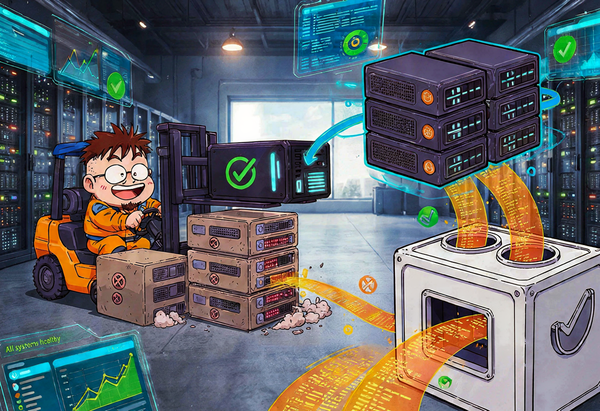
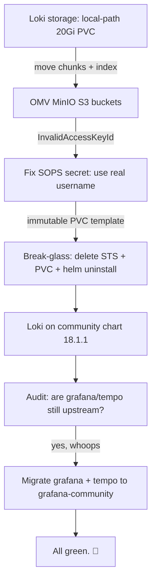
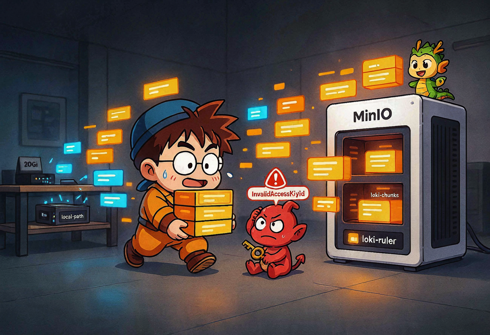
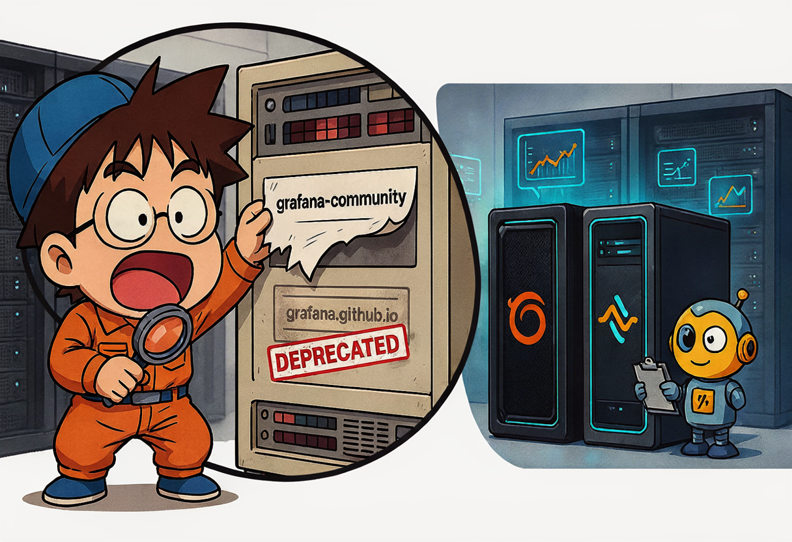

So. June 26th. I woke up, looked at my homelab, and realised my beautiful "LGTM" observability stack was quietly running on **deprecated charts**. You know that feeling when you maintain something for weeks, it works, you feel smart, and then a README tells you "upstream support ended Jan 30 2026"? Yeah. That. 😅

It was one of those days where you start with "let me just move Loki's storage to S3" and you end up forklift-upgrading three HelmReleases, breaking a StatefulSet, and nuking a PVC — because apparently I can't do one thing at a time.

Let me walk you through the carnage. And the fixes. Mostly the fixes.

## The plan (and how it grew)

Here's what the day actually looked like:



{: .prompt-info }
The "LGTM" stack is **L**oki, **G**rafana, **T**empo, **M**etrics (Prometheus). Mine runs on a single-node k3s cluster called `homelab-2nd`, with OMV (`openmediavault`) hosting MinIO as the durable storage box. Two machines, one job.

## Part 1 — Loki moves its logs to S3 (and lies to me about the key)

Loki was happily writing logs to a 20Gi `local-path` PVC on the k3s node's NVMe. Fast? Yes. Durable? **No.** If the node rebuilds, every log is gone. And my own storage rule says: rebuildable stuff on `local-path`, durable stuff on OMV MinIO. Logs are durable. So they had to move.

I created two MinIO buckets on OMV (`loki-chunks`, `loki-ruler`), a dedicated `loki-service-account` IAM user scoped to just those buckets, and a SOPS-encrypted secret. Then I rewrote the Loki HelmRelease values:

```yaml
# infrastructure/observability/loki-helm-release.yaml (the juicy part)
spec:
  values:
    global:
      extraEnvFrom:
        - secretRef:
            name: loki-minio-creds
    deploymentMode: Monolithic
    loki:
      storage:
        type: s3
        bucketNames:
          chunks: loki-chunks
          ruler: loki-ruler
        s3:
          endpoint: http://10.0.0.1:9000
          s3ForcePathStyle: true
          insecure: true
          accessKeyId: ${S3_ACCESS_KEY_ID}
          secretAccessKey: ${S3_SECRET_ACCESS_KEY}
      schemaConfig:
        configs:
          - from: "2024-01-01"
            index:
              period: 24h
              prefix: index_
            object_store: s3
            schema: v13
            store: tsdb
    singleBinary:
      replicas: 1
      extraArgs:
        - -config.expand-env=true
      extraEnvFrom:
        - secretRef:
            name: loki-minio-creds
      persistence:
        enabled: true
        size: 1Gi
        storageClass: local-path
```

Two things to notice:

1. The `${S3_ACCESS_KEY_ID}` placeholders only work because of `-config.expand-env=true` in `extraArgs`. Without that flag Loki treats them as literal strings and MinIO laughs at you.
2. The local PVC dropped from 20Gi → 1Gi. It now only holds WAL and working files. The actual chunks live on S3.

The secret itself is SOPS-encrypted with the repo's age key, so the public repo is safe:

```yaml
# infrastructure/observability/loki-minio-creds.sops.yaml
apiVersion: v1
kind: Secret
metadata:
  name: loki-minio-creds
  namespace: observability
data:
  S3_ACCESS_KEY_ID: ENC[AES256_GCM,data:llbu/Q4pl7289YcMQAnB8xkvNsFzZKr87oFBGw==,...]
  S3_SECRET_ACCESS_KEY: <REDACTED>
sops:
  age:
    - enc: |
        -----BEGIN AGE ENCRYPTED FILE-----
        ...
        -----END AGE ENCRYPTED FILE-----
  encrypted_regex: ^(data|stringData)$
```



### The `InvalidAccessKeyId` betrayal

Loki started up, looked healthy for 4 seconds, then puked this all over its logs:

```
InvalidAccessKeyId: The Access Key Id you provided does not exist in our records.
```

I checked the secret. I checked it again. Then I realised what I'd done: when I generated the SOPS secret, I had pasted in the **random hex string I used as a password placeholder**, not the actual MinIO **username** (`loki-service-account`). The access key *is* the username in MinIO-land. The secret key is the password. I had them swapped in my head. 🤦

Fix: regenerate the secret with the correct username as `S3_ACCESS_KEY_ID`, commit, push, roll the StatefulSet. Two commits, one of them literally named `fix(loki): correct MinIO access key in SOPS secret`. Nobody's perfect.

### The immutable StatefulSet wall

After the secret was fixed, I hit the *next* wall. Helm upgrade refused:

```
StatefulSet.apps "loki" is invalid: spec: Forbidden: updates to statefulset spec
for fields other than 'replicas', ... are forbidden
```

Right. `volumeClaimTemplates` is immutable, and I changed the PVC size from 20Gi to 1Gi. You cannot shrink a PVC claim template in place. Period. So I did what every respectable homelabber does — I nuked it from orbit:

```bash
# Break-glass: the only way out of an immutable volumeClaimTemplate
sudo kubectl -n observability delete statefulset loki --cascade=orphan
sudo kubectl -n observability delete pod loki-0 --force --grace-period=0
sudo kubectl -n observability delete pvc storage-loki-0
export KUBECONFIG=/etc/rancher/k3s/k3s.yaml
sudo -E helm uninstall loki -n observability

# Then poke Flux so it does a clean install
sudo kubectl annotate kustomization -n flux-system infrastructure \
  reconcile.fluxcd.io/requestedAt="$(date +%Y-%m-%dT%H:%M:%SZ)" \
  --field-manager=flux-client-side-apply --overwrite
```

{: .prompt-warning }
This discards whatever was on the old PVC. For me that was fine — the S3 buckets already held the durable data, and the local PVC only had working files. If you copy this, make sure you're not nuking the only copy of something you love.

After Flux reinstalled, `loki-0` came up with a 1Gi PVC, connected to MinIO, and the `loki-chunks` bucket started filling with `fake/<tenant>/...tsdb.gz` files. Logs were queryable via `loki-gateway`. 🎉

## Part 2 — "Wait, is my chart deprecated?"

While I was riding the high of working S3 storage, I noticed the `grafana/loki` chart I was on (`v6.29.0`) was actually the **Enterprise-only** upstream. The OSS fork had moved to `grafana-community/helm-charts`. So I migrated Loki to `grafana-community/loki` chart `18.1.1` (Loki `3.7.3`).

That worked so cleanly that I decided to audit the rest of the observability stack. Big mistake. Huge. 😎

I opened `infrastructure/observability/helm-repositories.yaml` and found this gem:

```yaml
apiVersion: source.toolkit.fluxcd.io/v1
kind: HelmRepository
metadata:
  name: grafana-community
  namespace: flux-system
spec:
  interval: 1h
  url: https://grafana.github.io/helm-charts   # 👈 NOT community. Liar.
```

A HelmRepository **named** `grafana-community` that pointed at the **upstream** `grafana.github.io/helm-charts`. So my `grafana` and `tempo` HelmReleases thought they were using the community fork, but were actually pulling from upstream — which deprecated both charts on Jan 30 2026. Classic naming-is-hard situation.

The audit table told the whole story:

| HelmRelease | Was using | Should use | Status |
|---|---|---|---|
| `grafana` | upstream `grafana.github.io` (via misnamed repo) | `grafana-community` | migrated |
| `tempo` | upstream `grafana.github.io` | `grafana-community/tempo` | migrated |
| `loki` | already on community (today) | — | done |
| `prometheus-stack` | `prometheus-community` | — | already correct |
| `opentelemetry-collector` | `open-telemetry` | — | already correct |

Fix: change the repo URL to the real community one, delete the now-redundant `loki-helm-repository.yaml`, bump chart versions, and let Flux do its thing.

```yaml
# infrastructure/observability/helm-repositories.yaml — after
apiVersion: source.toolkit.fluxcd.io/v1
kind: HelmRepository
metadata:
  name: grafana-community
  namespace: flux-system
spec:
  interval: 1h
  url: https://grafana-community.github.io/helm-charts
```



### Grafana 13.1.0 and the duplicate `release` key

Grafana bumped to chart `12.7.1` (Grafana `13.1.0`). I enabled the ServiceMonitor and — being a careful person who reads docs — added `serviceMonitor.labels.release: kube-prometheus-stack` so Prometheus would pick it up.

Helm said no:

```
mapping key "release" already defined
```

The community chart **already** injects `release: <helm-release-name>` into the ServiceMonitor. My extra `release` key collided. Fix: delete my label and trust the chart. The Grafana release is named `grafana`, so the label becomes `release: grafana`, and because kube-prometheus-stack is configured with `serviceMonitorSelectorNilUsesHelmValues: false`, Prometheus scrapes it anyway. Two hours of my life I'll never get back. 😅

The Grafana HelmRelease now looks like this (datasources provisioned directly in values):

```yaml
# infrastructure/observability/grafana-helm-release.yaml
spec:
  chart:
    spec:
      chart: grafana
      version: "12.7.1"
      sourceRef:
        kind: HelmRepository
        name: grafana-community
        namespace: flux-system
  values:
    datasources:
      datasources.yaml:
        apiVersion: 1
        datasources:
          - name: Prometheus
            type: prometheus
            url: http://prometheus-stack-kube-prom-prometheus.observability.svc.cluster.local:9090
            isDefault: true
          - name: Loki
            type: loki
            url: http://loki-gateway.observability.svc.cluster.local:80
          - name: Tempo
            type: tempo
            url: http://tempo.observability.svc.cluster.local:3200
    serviceMonitor:
      enabled: true
      # NOTE: do NOT add labels.release — the chart does it for you.
```

### Tempo goes CrashLoopBackOff, then gets nuked

Tempo was the drama queen of the day. Upstream chart `1.24.4` was wedged, the old pod was OOMKilled replaying WAL on a 512Mi limit, and the Helm upgrade failed and rolled back. So Tempo got the same break-glass treatment as Loki:

```bash
export KUBECONFIG=/etc/rancher/k3s/k3s.yaml
sudo -E helm uninstall tempo -n observability
sudo kubectl -n observability delete pod tempo-0 --force --grace-period=0
sudo kubectl -n observability delete pvc storage-tempo-0
sudo kubectl annotate helmrelease -n observability tempo \
  reconcile.fluxcd.io/requestedAt="$(date +%Y-%m-%dT%H:%M:%SZ)" \
  --field-manager=flux-client-side-apply --overwrite
```

Fresh install from community chart `2.2.3` (Tempo `2.10.7`), with the memory limit bumped to 1Gi because WAL replay needs more than 512Mi:

```yaml
# infrastructure/observability/tempo-helm-release.yaml
spec:
  chart:
    spec:
      chart: tempo
      version: "2.2.3"
      sourceRef:
        kind: HelmRepository
        name: grafana-community
        namespace: flux-system
  values:
    tempo:
      receivers:
        otlp:
          protocols:
            grpc:
              endpoint: 0.0.0.0:4317
            http:
              endpoint: 0.0.0.0:4318
      storage:
        trace:
          backend: local
          local:
            path: /var/tempo/traces
          wal:
            path: /var/tempo/wal
      retention: 168h  # 7 days
      resources:
        requests:
          cpu: 50m
          memory: 256Mi
        limits:
          memory: 1Gi   # 👈 the fix for the OOMKills
```

{: .prompt-danger }
I intentionally discarded the old trace data during the Tempo reinstall. Traces are ephemeral (7-day retention on local storage), so that's acceptable for my homelab. If you run a production Tempo, do **not** copy this break-glass without a backup plan.

After all that, the whole observability namespace was green:

```
grafana      grafana@12.7.1      (Grafana 13.1.0)   Ready
tempo        tempo@2.2.3         (Tempo 2.10.7)     Ready
loki         loki@18.1.1         (Loki 3.7.3)       Ready
prometheus   kube-prometheus-stack@87.2.1           Ready
otel         opentelemetry-collector@0.159.0        Ready
```

Not a single upstream Grafana chart left. The forklift upgrade was complete. 🎸

## What I learned today

1. **Read the chart's README before you trust a HelmRepository name.** A repo called `grafana-community` that points at `grafana.github.io` is just a lie in YAML form.
2. **`volumeClaimTemplates` is immutable.** Changing PVC size means deleting the StatefulSet and starting fresh. Plan for it.
3. **MinIO access key = username, secret key = password.** I knew this. I still got it wrong the first time. 😅

## What's next

- Investigate the OTel collector's intermittent `prometheusremotewrite` `context deadline exceeded` — it's been nagging me.

One day, three migrations, zero upstream Grafana charts left standing. 🎸