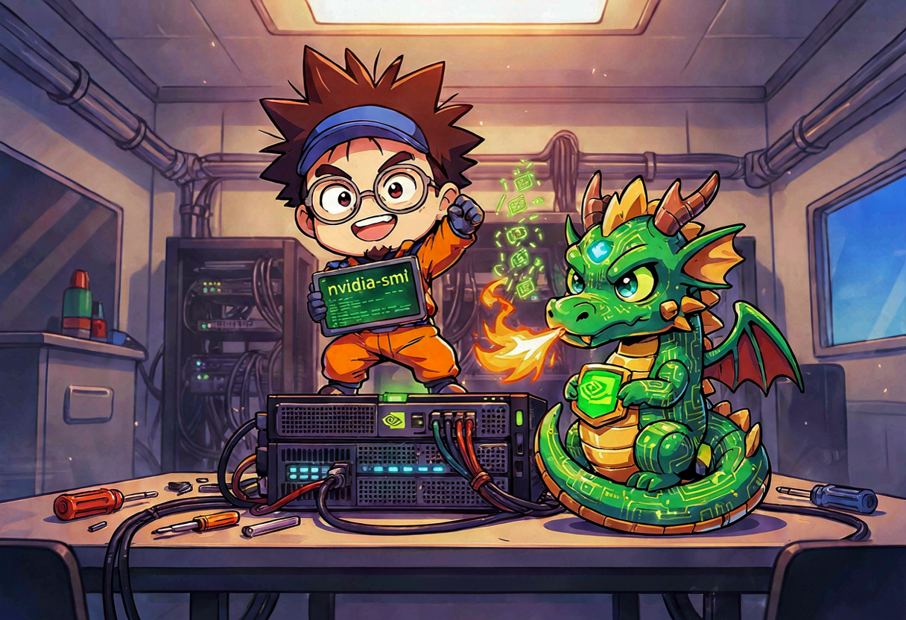
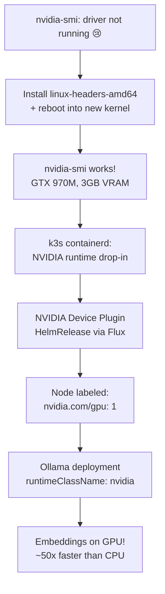
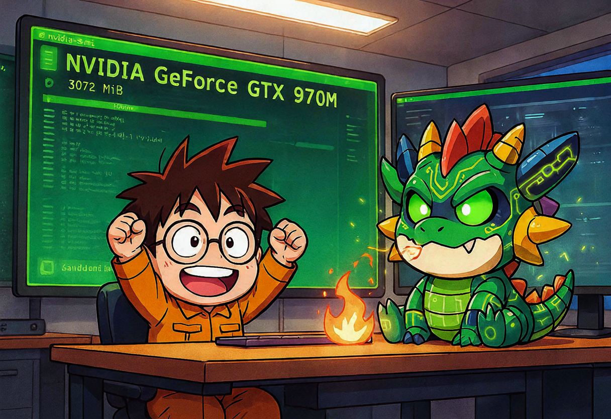
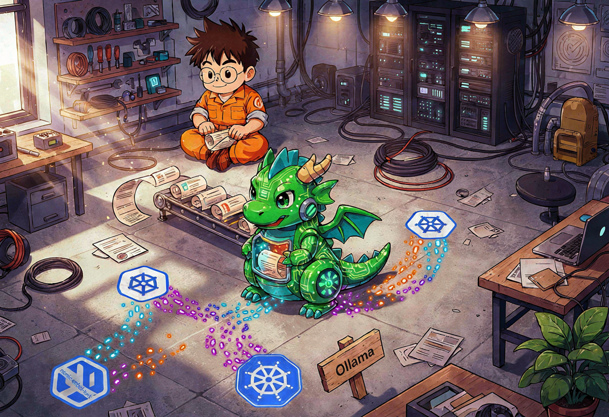

## The problem with doing everything on a CPU

So here's the thing. My homelab-2nd node — the one running k3s and Flux and basically the whole cluster — has an NVIDIA GPU. A **GeForce GTX 960 OEM / 970M**, to be exact. The GM204 chip. Maxwell architecture. Compute capability 5.2. Three gigabytes of VRAM. Released roughly when dinosaurs still roamed the earth, or at least when I still thought 1080p was a lot of pixels 😅

And for months, that GPU just sat there. Doing nothing. Drawing idle power. Meanwhile, every time my docs-mcp-server needed to index documentation, the **CPU** did the embeddings. Indexing the FluxCD docs took *so long* that I could go make coffee, drink the coffee, wash the cup, and come back to a progress bar that had moved maybe 12%.

For comparison: the same job on my M1 Max takes about 50 seconds.

Something had to change. The old dragon was sleeping, and it was time to wake it up 🐉

{: .prompt-info }
**The plan:** install the NVIDIA driver on Debian 13, configure k3s containerd for the NVIDIA runtime, deploy the NVIDIA Device Plugin via Flux, and run a tiny embedding model (`nomic-embed-text`) as a GPU workload inside k3s. Everything GitOps-managed. No snowflakes.



## Step 1 — The driver that was installed but not really

The GPU was there in `lspci`:

```bash
ssh homelab-2nd "lspci | grep -i nvidia"
# 01:00.0 VGA compatible controller: NVIDIA Corporation GM204M [GeForce GTX 960 OEM / 970M] (rev a1)
```

But `nvidia-smi` just laughed at me:

```
NVIDIA-SMI has failed because it couldn't communicate with the NVIDIA driver.
Make sure that the latest NVIDIA driver is installed and running.
```

No `/dev/nvidia*` devices either. The driver *package* was installed (`nvidia-driver` metapackage, version `550.163.01-2`, plus `nvidia-kernel-dkms`), but the running kernel (`6.12.57+deb13-amd64`) had no matching DKMS build. So the module could not load. Classic Debian situation: the package is there, the build isn't.

The fix was almost too easy:

```bash
# Install headers, which pulled in a newer kernel + headers + kbuild
sudo apt install linux-headers-amd64
# The post-install hooks ran DKMS automatically and built nvidia-current/550.163.01
# Reboot into the new kernel (6.12.94+deb13-amd64)
sudo reboot
```

After reboot:

```bash
nvidia-smi
# NVIDIA-SMI 550.163.01   Driver Version: 550.163.01   CUDA Version: 12.4
# +-----------------------------------------------------------------------------+
# | NVIDIA-SMI 550.163.01   Driver Version: 550.163.01   CUDA Version: 12.4     |
# |-------------------------------+----------------------+----------------------+
# |   0  NVIDIA GeForce GTX 970M  3072MiB               55C             7W    |
# +-------------------------------+----------------------+----------------------+
```

`/dev/nvidia0`, `/dev/nvidiactl`, `/dev/nvidia-modeset`, `/dev/nvidia-uvm` all present. Kernel modules `nvidia`, `nvidia_modeset`, `nvidia_drm`, `nvidia_uvm` loaded. The dragon had a pulse 💚

{: .prompt-warning }
On Debian 13 (trixie), if you install the `nvidia-driver` metapackage but skip `linux-headers-amd64`, DKMS won't have anything to build against for your *current* kernel. The newer kernel that the headers pull in is the one that actually gets the module built. Don't forget to reboot into it.



## Step 2 — Teaching k3s containerd to speak NVIDIA

Now the GPU works on the host. But k3s uses its own containerd, and that containerd does not know what an NVIDIA runtime is. You have to tell it.

The "official" way is to override the whole containerd config template (`config-v3.toml.tmpl`). I tried that. k3s refused to start with `containerd exited: exit status 1`. Not great.

The cleaner approach is a **drop-in file** instead of a full template override:

```toml
# /var/lib/rancher/k3s/agent/etc/containerd/config-v3.toml.d/nvidia-runtime.toml
# NVIDIA runtime for GPU workloads in k3s
[plugins."io.containerd.cri.v1.runtime".containerd.runtimes.nvidia]
  runtime_type = "io.containerd.runc.v2"
  [plugins."io.containerd.cri.v1.runtime".containerd.runtimes.nvidia.options]
    BinaryName = "/usr/bin/nvidia-container-runtime"
    SystemdCgroup = true
```

k3s reads all `.toml` files in that `config-v3.toml.d/` directory and merges them. This way you don't fight the template, you just add a runtime.

One more gotcha: `nvidia-container-runtime` couldn't find `runc`/`crun` in its default search path. A symlink fixed that:

```bash
ln -sf /var/lib/rancher/k3s/data/current/bin/runc /usr/local/bin/runc
```

After that, `systemctl restart k3s` and it came up clean. The NVIDIA runtime was registered.

## Step 3 — The NVIDIA Device Plugin (via Flux, obviously)

Since the whole cluster is GitOps-managed by Flux, the device plugin had to be a HelmRelease, not a `kubectl apply` one-liner I'd forget about. Everything lives in `infrastructure/nvidia-device-plugin/` in the homelab repo.

First, a RuntimeClass so pods can ask for the NVIDIA runtime by name:

```yaml
# infrastructure/nvidia-device-plugin/runtimeclass.yaml
# RuntimeClass for the NVIDIA container runtime.
# Pods using this class will be run by containerd with nvidia-container-runtime,
# giving them access to NVIDIA devices and NVML.
apiVersion: node.k8s.io/v1
kind: RuntimeClass
metadata:
  name: nvidia
handler: nvidia
```

Then a ConfigMap with an explicit `deviceDiscoveryStrategy`. This was the second dragon I had to slay — the NVIDIA Device Plugin defaults to an `auto` discovery strategy that GPU Feature Discovery (GFD) does **not** support on this single-GPU node. GFD crashed with `unsupported strategy auto`. So I pinned it down:

```yaml
# infrastructure/nvidia-device-plugin/configmap.yaml
# NVIDIA device plugin / GPU feature discovery configuration.
# Explicit device discovery strategy avoids the unsupported 'auto' default
# on the homelab-2nd single-Maxwell GPU node.
apiVersion: v1
kind: ConfigMap
metadata:
  name: nvidia-plugin-config
  namespace: nvidia-device-plugin
data:
  config.yaml: |
    version: v1
    flags:
      migStrategy: "none"
      failOnInitError: true
      nvidiaDriverRoot: "/"
      plugin:
        passDeviceSpecs: false
        deviceListStrategy: envvar
        deviceIDStrategy: uuid
```

And the HelmRelease itself, with GFD and NFD both enabled so the node gets auto-labeled:

```yaml
# infrastructure/nvidia-device-plugin/helm-release.yaml (values section)
spec:
  interval: 1h
  chart:
    spec:
      chart: nvidia-device-plugin
      version: "0.17.1"
      sourceRef:
        kind: HelmRepository
        name: nvidia-device-plugin
        namespace: flux-system
      interval: 1h
  values:
    tolerations:
      - key: node-role.kubernetes.io/control-plane
        operator: Exists
        effect: NoSchedule
      - key: nvidia.com/gpu
        operator: Exists
        effect: NoSchedule
    config:
      name: nvidia-plugin-config   # the ConfigMap above
    runtimeClassName: nvidia
    gfd:
      enabled: true
      runtimeClassName: nvidia
    nfd:
      enabled: true
    resources:
      requests:
        cpu: 50m
        memory: 64Mi
      limits:
        memory: 256Mi
```

After Flux reconciled, the node got labeled automatically:

```bash
kubectl get nodes -o json | jq '.items[].metadata.labels | with_entries(select(.key | test("nvidia|pci-10de")))'
# {
#   "feature.node.kubernetes.io/pci-10de.present": "true",
#   "nvidia.com/gpu.count": "1",
#   "nvidia.com/gpu.product": "GeForce_GTX_970M",
#   "nvidia.com/gpu.present": "true"
# }
```

And the allocatable resources now included the GPU:

```bash
kubectl describe node homelab-2nd | grep -A2 "Allocatable"
# Allocatable:
#   nvidia.com/gpu:  1
```

The dragon could now be scheduled 🐉

{: .prompt-tip }
Enable **both** `gfd.enabled=true` and `nfd.enabled=true` in the HelmRelease. NFD is what actually scans the PCI bus and creates the `pci-10de.present` label. GFD then reads that label and adds the richer `nvidia.com/gpu.*` labels. Without NFD, the device plugin DaemonSet won't schedule because the node selector finds nothing.

## Step 4 — TEI says no (the compute capability wall)

For the embedding server, my first choice was HuggingFace's `text-embeddings-inference` (TEI). It's Rust-based, purpose-built for embeddings, and lighter than running full Ollama. I even wrote a full Deployment for it:

```yaml
# apps/gpu-embedding/tei-deployment.yaml (abandoned)
apiVersion: apps/v1
kind: Deployment
metadata:
  name: tei-embedding-server
  namespace: gpu-embedding
spec:
  selector:
    matchLabels:
      app.kubernetes.io/name: tei-embedding-server
  template:
    spec:
      nodeSelector:
        feature.node.kubernetes.io/pci-10de.present: "true"
      runtimeClassName: nvidia
      tolerations:
        - key: nvidia.com/gpu
          operator: Exists
          effect: NoSchedule
      containers:
        - name: tei
          image: ghcr.io/huggingface/text-embeddings-inference:cuda-1.9
          args:
            - --model-id
            - "nomic-ai/nomic-embed-text-v1.5"
            - --port
            - "3000"
            - --served-model-name
            - "nomic-embed-text"
```

Looks clean, right? It crashed immediately:

```
cuda compute cap 52 is not supported
```

{: .prompt-danger }
HuggingFace `text-embeddings-inference` prebuilt images only support CUDA **compute capability 7.5+** (Turing and newer). The GTX 970M is Maxwell — `sm_52`. TEI simply will not run on this GPU without compiling a custom image from source. That was not a rabbit hole I wanted to enter on a 40°C day in Düsseldorf 😅

So the decision was: **switch to Ollama**, which supports Maxwell out of the box. Less elegant than TEI, but it actually works.

The TEI manifests stay in the repo (`apps/gpu-embedding/tei-*.yaml`) but out of the active `kustomization.yaml`, waiting for either a custom `CUDA_COMPUTE_CAP=52` build or a GPU upgrade that may never come.

## Step 5 — Ollama on the GPU

Ollama it is. But there's one more version trap: **newer Ollama images (0.30.x and up) bundle CUDA libraries that require NVIDIA driver 570+**. Debian 13 currently ships driver `550.163.01`. So I had to pin the image:

```yaml
# apps/gpu-embedding/ollama-deployment.yaml
apiVersion: apps/v1
kind: Deployment
metadata:
  name: ollama-embeddings
  namespace: gpu-embedding
spec:
  replicas: 1
  selector:
    matchLabels:
      app.kubernetes.io/name: ollama-embeddings
  template:
    metadata:
      labels:
        app.kubernetes.io/name: ollama-embeddings
    spec:
      # Use the NVIDIA container runtime so CUDA devices and driver libs are mounted.
      runtimeClassName: nvidia
      nodeSelector:
        feature.node.kubernetes.io/pci-10de.present: "true"
      tolerations:
        - key: nvidia.com/gpu
          operator: Exists
          effect: NoSchedule
      initContainers:
        - name: pull-model
          image: ollama/ollama:0.3.14    # pinned for driver 550 compat
          command:
            - /bin/sh
            - -c
            - |
              set -e
              ollama serve &
              SERVE_PID=$!
              until ollama list >/dev/null 2>&1; do
                echo "Waiting for Ollama API..."
                sleep 1
              done
              echo "Pulling nomic-embed-text..."
              ollama pull nomic-embed-text
              kill $SERVE_PID
              wait $SERVE_PID 2>/dev/null || true
          env:
            - name: OLLAMA_HOST
              value: "127.0.0.1:11434"
            - name: HOME
              value: "/root"
          volumeMounts:
            - name: ollama-models
              mountPath: /root/.ollama
      containers:
        - name: ollama
          image: ollama/ollama:0.3.14
          ports:
            - name: http
              containerPort: 11434
          env:
            - name: OLLAMA_HOST
              value: "0.0.0.0:11434"
            - name: HOME
              value: "/root"
          volumeMounts:
            - name: ollama-models
              mountPath: /root/.ollama
          resources:
            requests:
              cpu: 500m
              memory: 1Gi
              nvidia.com/gpu: 1
            limits:
              memory: 4Gi
              nvidia.com/gpu: 1
          livenessProbe:
            httpGet:
              path: /
              port: 11434
            initialDelaySeconds: 30
            periodSeconds: 15
      volumes:
        - name: ollama-models
          persistentVolumeClaim:
            claimName: ollama-models
```

The init container pulls `nomic-embed-text` (137M params, ~550MB on GPU) before the main container starts, so the first readiness probe doesn't get a cold model. The model weights live on a `local-path` PVC so they survive pod restarts:

```yaml
# apps/gpu-embedding/ollama-models-pvc.yaml
apiVersion: v1
kind: PersistentVolumeClaim
metadata:
  name: ollama-models
  namespace: gpu-embedding
spec:
  accessModes:
    - ReadWriteOnce
  storageClassName: local-path
  resources:
    requests:
      storage: 20Gi
```

And the Service — a NodePort so LAN clients (like Docker on the Hermes host) can also reach it, not just in-cluster pods:

```yaml
# apps/gpu-embedding/ollama-service.yaml
# Internal: http://ollama-embeddings.gpu-embedding.svc.cluster.local:11434
# LAN:      http://10.0.0.1:30114/v1
apiVersion: v1
kind: Service
metadata:
  name: ollama-embeddings
  namespace: gpu-embedding
spec:
  type: NodePort
  selector:
    app.kubernetes.io/name: ollama-embeddings
  ports:
    - name: http
      port: 11434
      targetPort: http
      nodePort: 30114
      protocol: TCP
```



## Step 6 — Migrating docs-mcp to the GPU

Once the GPU embedding server was running, docs-mcp-server had to point at it. Previously it used a CPU-only Ollama in its own namespace. The change was a one-liner environment variable:

```yaml
# apps/docs-mcp/docs-mcp-deployment.yaml (env section)
env:
  - name: DOCS_MCP_EMBEDDING_MODEL
    value: "openai:nomic-embed-text"
  - name: OPENAI_API_BASE
    value: "http://ollama-embeddings.gpu-embedding.svc.cluster.local:11434/v1"
  # (was: http://ollama-embeddings.docs-mcp.svc.cluster.local:11434/v1)
```

The old CPU-only Ollama files (`apps/docs-mcp/ollama-deployment.yaml`, `ollama-service.yaml`, `ollama-models-pvc.yaml`) got deleted from the repo and removed from the kustomization. Goodbye, CPU embeddings. You were slow but you tried.

{: .prompt-info }
The GPU embedding server is now a **shared platform service**. Any namespace can call `http://ollama-embeddings.gpu-embedding.svc.cluster.local:11434/v1` — docs-mcp today, and future consumers (OpenViking memory, mem0, whatever comes next) tomorrow. That's the whole point of putting it in its own `gpu-embedding` namespace rather than inside `docs-mcp`.

## Does it actually work?

Pod running, GPU detected:

```
ollama-embeddings-b476fdbf9-cqqxj   1/1   Running   homelab-2nd
```

Ollama logs confirm CUDA on the Maxwell chip:

```
inference compute id=GPU-... library=cuda variant=v11 compute=5.2 driver=12.4
  name="NVIDIA GeForce GTX 970M" total="2.9 GiB"
```

And `nvidia-smi` inside the pod shows the model loaded:

```
|  0  NVIDIA GeForce GTX 970M   703MiB / 3072MiB   ollama_llama_server |
```

Smoke test from a debug pod in the `gpu-embedding` namespace:

```bash
# Ollama native API
curl -X POST http://ollama-embeddings.gpu-embedding.svc.cluster.local:11434/api/embeddings \
  -H 'Content-Type: application/json' \
  -d '{"model":"nomic-embed-text","prompt":"hello world"}'

# OpenAI-compatible API
curl -X POST http://ollama-embeddings.gpu-embedding.svc.cluster.local:11434/v1/embeddings \
  -H 'Content-Type: application/json' \
  -H 'Authorization: Bearer ***' \
  -d '{"model":"nomic-embed-text","input":"hello world"}'
```

Both return 768-dimensional embeddings. The dragon breathes fire again 🔥

## Because of course I added a Grafana dashboard

What's the point of having a GPU in your homelab if you can't stare at graphs about it? I deployed `utkuozdemir/nvidia-gpu-exporter` as another Flux HelmRelease to expose `nvidia_smi_*` metrics, and built a Grafana dashboard called **Homelab GPU & Power** with panels for:

- GPU utilization %
- GPU memory used
- GPU temperature + power draw (W)
- CPU package temperature
- CPU package power (RAPL, W)

Live samples at idle:

| Metric | Value |
|---|---|
| `nvidia_smi_utilization_gpu_ratio` | 0.00 |
| `nvidia_smi_memory_used_bytes` | ~5 MiB |
| `nvidia_smi_temperature_gpu` | 59 °C |
| `nvidia_smi_power_draw_watts` | 8.23 W |
| `node_rapl_package_joules_total` | 28043.36 J |

{: .prompt-warning }
The RAPL energy counters under `/sys/class/powercap` are root-readable only by default, so the node-exporter RAPL collector fails with `node_scrape_collector_success{collector="rapl"} 0`. Fix: enable the kube-prometheus-stack chart's `nodeExporter.permissionInitContainer.fixes.rapl` toggle. Don't fight PodSecurityContext manually — the chart already has an init container for exactly this.

## What I'd do differently

Looking back at the whole journey, here are the real lessons:

1. **Install the headers at the same time as the driver.** The driver metapackage without matching headers is just a package, not a working driver.
2. **Use containerd drop-ins, not template overrides.** The template override is a sledgehammer. Drop-ins are surgical.
3. **Pin your Ollama image.** `ollama/ollama:latest` will break on driver 550 eventually. `0.3.14` is my safe floor until Debian ships driver 570+.
4. **Check compute capability before you write the manifest.** TEI and the GTX 970M were never going to be friends. Ollama was the answer from the start — I just had to learn it the hard way 😅
5. **Put shared services in their own namespace.** `gpu-embedding` is not a `docs-mcp` thing. It's a platform thing. Future me (and future agents) will thank present me.

## What's next

- Monitor GPU memory and temperature during sustained indexing (it was 40 °C ambient in Düsseldorf today — the Clevo chassis is working overtime, and so is the air conditioner that doesn't exist).
- Watch the `Homelab GPU & Power` Grafana dashboard during a reindex to validate the load and power numbers are real.
- When Debian 13 non-free packages for driver 570+ appear, bump Ollama back toward `latest`.
- Keep the TEI manifests in the repo, shelved, in case someone builds a `CUDA_COMPUTE_CAP=52` image or the GPU gets upgraded to something that doesn't predate the Tesla autopilot.

The old Maxwell dragon is awake, it's doing useful work, and it's managed by the same GitOps pipeline as everything else. Not bad for a GPU that's older than some of my homelab ideas 🐉😎

*Tracking note: [[2026-06-27-gpu-embedding-preflight]]*