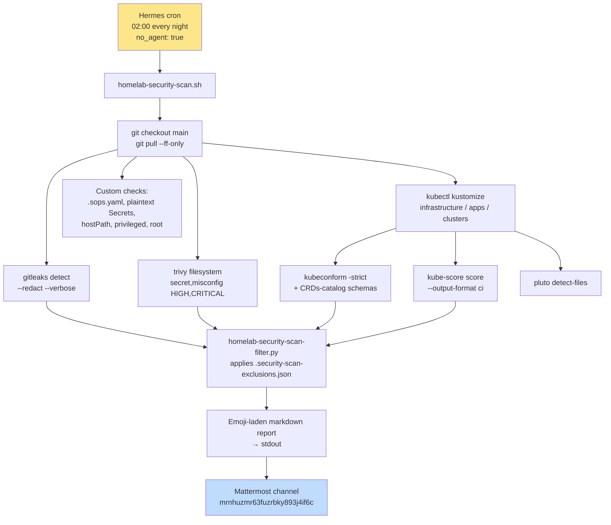

Here's a fun question: **what's actually in your public GitOps repo?**

My homelab-2nd repo (`gulasz101/homelab-2nd`) is public on GitHub. It contains every HelmRelease, every Kustomization, every SOPS-encrypted secret, every ADR. It's the source of truth for the whole cluster. I love that it's public — it forces good hygiene and it might help someone else build their own.

But "public" also means: if I accidentally commit a real API key, the whole internet can see it. If I slip in a `privileged: true` container without thinking, it's right there. If a Helm chart quietly starts using a deprecated Kubernetes API, I want to know before k3s upgrades and breaks things.

So on June 28th I built a **nightly security scan** that runs at 02:00, scans the repo with five different tools, and posts an emoji-laden report to a Mattermost channel. Then I spent two more days teaching it to shut up about noise it couldn't do anything about. Let me show you both halves.

{: .prompt-warning}
This scan is **repo-only**. It does NOT touch the live k3s cluster. Scanning live cluster state is a separate future task — different scope, different responsibility. Single Responsibility Principle, remember? 🧹

## The scanner stack

Five tools, each doing one job:

| Tool | What it does |
|---|---|
| **gitleaks** | Scans every git commit for strings that look like API keys, tokens, passwords. Entropy + regex rules. |
| **trivy** | Filesystem scan for hardcoded secrets + Kubernetes/Docker misconfigurations. HIGH and CRITICAL only. |
| **kubeconform** | Validates rendered Kubernetes manifests against JSON schemas. Catches typos, wrong API versions, invalid fields. |
| **kube-score** | Best-practice scoring: resource limits, security contexts, probes, network policies. Opinionated. |
| **pluto** | Detects deprecated Kubernetes APIs so k3s upgrades don't break me later. |

Plus a set of **custom GitOps checks** the scanners don't cover: is `.sops.yaml` present? Are there plaintext `Secret` manifests? Any `hostPath` volumes, `privileged: true` containers, or `runAsUser: 0`?

Here's how the whole pipeline fits together:



## The cron job

The scan is a Hermes cron job, not a Kubernetes CronJob — it runs on the MacBook (where the repo lives and where the scanner binaries are installed), not in the cluster. The key trick is `no_agent: true`: the script's stdout becomes the channel post directly, no LLM in the loop.

```
Job ID: 89499b7d034b
Schedule: 0 2 * * *
Delivers to: mattermost:mrnhuzmr63fuzrbky893j4if6c
no_agent: true   # script stdout → channel post, verbatim
```

The script lives at `~/.hermes/profiles/andrzej/scripts/homelab-security-scan.sh` and delegates to the repo copy at `scripts/homelab-security-scan.sh`. Keeping the real logic in the repo means it's versioned with the thing it scans.

## The script (the important parts)

Here's the skeleton of what the scanner does. I'll show the real code from the repo, not a cleaned-up version:

```bash
#!/bin/bash
# Nightly security scan for the gulasz101/homelab-2nd GitOps repo.
set -u

REPO="${REPO:-$HOME/Projects/homelab-2nd}"
TMPDIR="$(mktemp -d -t homelab-security-scan-XXXXXX)"
trap 'rm -rf "$TMPDIR"' EXIT

cd "$REPO" || { echo "Cannot cd to $REPO"; exit 1; }
EXCLUSIONS_FILE="$REPO/.security-scan-exclusions.json"

# 1. Refresh repo
git checkout main && git pull --ff-only
GIT_SHA="$(git rev-parse --short HEAD)"

# 2. Gitleaks — secret detection in git history
gitleaks detect --redact --verbose --report-format json \
  --report-path "$TMPDIR/gitleaks.json" . || true

# 3. Trivy — filesystem secret + misconfig
trivy filesystem --scanners secret,misconfig --severity HIGH,CRITICAL \
  --format json --output "$TMPDIR/trivy.json" . || true

# 4. Render Kustomizations, then validate with kubeconform
for dir in infrastructure apps clusters/homelab-2nd; do
  kubectl kustomize "$dir" > "$TMPDIR/rendered-$dir.yaml" 2>/dev/null || true
done
kubeconform -strict -summary -schema-location default \
    -schema-location 'https://raw.githubusercontent.com/datreeio/CRDs-catalog/main/{{.Group}}/{{.ResourceKind}}_{{.ResourceAPIVersion}}.json' \
    -output json "$TMPDIR"/rendered-*.yaml || true

# 5. kube-score, 6. pluto, 7. custom checks, 8. summary ...
```

Every scanner is wrapped in `|| true` because a security finding is a *non-zero exit* for most of these tools, and I don't want the script to bail halfway through — I want all five reports in one run.

### The custom GitOps checks

This is the part the off-the-shelf scanners don't cover, and it matters because the repo is public:

```bash
# Plaintext Secret detection — any Secret resource that isn't SOPS-encrypted
while IFS= read -r -d '' file; do
  if grep -qE '^kind:\s*Secret' "$file" && ! grep -qE '^sops:' "$file"; then
    PLAIN_SECRET=$((PLAIN_SECRET + 1))
    echo "  Plaintext Secret: ${file#$REPO/}"
  fi
  # hostPath, privileged, root user ...
done < <(find "$REPO" -type f \( -name '*.yaml' -o -name '*.yml' \) -print0)
```

The rule is simple: a `kind: Secret` without a `sops:` block is a problem. SOPS-encrypted secrets have a `sops:` metadata section at the bottom — that's how you tell them apart from plaintext ones. If I ever commit a real plaintext secret, this catches it.

## The first run: 4 criticals, 136 warnings 😬

The first scan on June 28th (commit `ae2587e`) was noisy:

| Category | Count |
|---|---|
| **Critical** | 4 |
| **Warnings** | 136 |

The criticals:

1. **Gitleaks finding** in `infrastructure/cnpg/barman-cloud-plugin-manifest.yaml` — the `kubernetes-secret-yaml` rule fired on a base64-encoded sidecar image reference. Not a real credential, but a generated CRD manifest that *looks* like one.
2. **Plaintext Secret** — same barman-cloud file. A static generated manifest containing a `Secret` resource.
3. **hostPath volume** — the nvidia-gpu-exporter, which needs host nvidia-smi access.
4. **Privileged container** — also the nvidia-gpu-exporter, which needs privileged access to the NVIDIA driver devices.

The warnings were dominated by:
- 36 Trivy misconfig hits (read-only rootfs, default security contexts, host ports) — mostly from rendered upstream Helm charts.
- 28 kubeconform invalid resources — missing CRD schemas for `helm.toolkit.fluxcd.io`, `cnpg.io`, `grafana.integreatly.org`, etc.
- 71 kube-score warnings/criticals — upstream chart defaults that don't set resource limits or run as root.
- 0 Pluto deprecated APIs (good news at least).

{: .prompt-warning}
A lot of these warnings come from **upstream Helm charts** that I render through Flux. I can't fix the chart defaults without forking the chart, and forking every chart is not a homelab activity — it's a full-time job. The noise has to be filtered, not fixed.

## The fix: an exclusions file and a filter script

Two days later (June 30th), I came back and made the scan report a clean headline. The principle: **suppress known, justified noise, but never silently** — suppressed items still appear in a "suppressed" section so nothing disappears into a black hole.

The exclusions live in `.security-scan-exclusions.json` in the repo:

```json
{
  "_comment": "Upstream-chart or architectural defaults we cannot remove without breaking functionality. Still reported in 'suppressed' so they don't disappear silently.",
  "trivy_misconfig": {
    "ids": ["KSV-0014", "KSV-0024", "KSV-0118", "KSV-0041", "KSV-0046"]
  },
  "kubeconform": {
    "missing_schema_groups": [
      "helm.toolkit.fluxcd.io", "barmancloud.cnpg.io", "cnpg.io",
      "keda.sh", "monitoring.coreos.com", "grafana.integreatly.org",
      "ingress-nginx.k8s.io", "apiextensions.k8s.io"
    ],
    "expected_invalid_kinds": ["Secret", "CustomResourceDefinition"],
    "expected_messages": ["additional properties 'sops' not allowed"]
  },
  "kube_score": {
    "suppress_ids": [
      "container-security-context-readonlyrootfilesystem",
      "container-security-context-user-group-id",
      "pod-networkpolicy", "container-resources",
      "container-ephemeral-storage-request-and-limit",
      "deployment-has-poddisruptionbudget",
      "container-image-tag", "container-image-pull-policy",
      "pod-probes", "deployment-has-host-podantiaffinity", "deployment-replicas"
    ]
  },
  "custom": {
    "hostpath_accepted": [
      { "file": "infrastructure/observability/nvidia-gpu-exporter-helm-release.yaml",
        "reason": "Consumer Maxwell GPU requires host nvidia-smi / libnvidia-ml.so mounts" }
    ],
    "privileged_accepted": [
      { "file": "infrastructure/observability/nvidia-gpu-exporter-helm-release.yaml",
        "reason": "Consumer Maxwell GPU requires privileged access to NVIDIA driver devices" }
    ],
    "root_accepted": [
      { "file": "infrastructure/observability/opentelemetry-collector-helm-release.yaml",
        "reason": "filelog receiver reads root-owned node log files" }
    ]
  }
}
```

{: .prompt-info}
Note the `reason` fields on the custom accepted items. Every exception has a *written justification*. "It's fine" is not a justification. "The filelog receiver reads root-owned node log files" is. If I can't write a one-line reason, it's not accepted — it's a real finding.


The filter script (`homelab-security-scan-filter.py`) is deliberately **stdlib-only Python** — no PyYAML, no external deps — because it runs in a minimal cron environment at 02:00 and I do not want to debug a missing dependency at 2am. It reads raw scanner JSON from stdin, applies the allowlist, and prints `{kept, suppressed}` for each scanner:

```python
#!/usr/bin/env python3
"""Filter helper for homelab-security-scan.sh.
Uses only the Python standard library so it runs in a minimal cron
environment without PyYAML."""
import json, sys, re

EXCLUSIONS_FILE = ".security-scan-exclusions.json"

def filter_trivy_misconfigs(trivy_json, exclusions):
    ids = set(exclusions.get("trivy_misconfig", {}).get("ids", []))
    kept, suppressed = [], []
    for r in trivy_json.get("Results", []) or []:
        for m in r.get("Misconfigurations") or []:
            item = {"id": m.get("ID"), "title": m.get("Title"),
                    "severity": m.get("Severity")}
            (suppressed if item["id"] in ids else kept).append(item)
    return kept, suppressed

def filter_kubeconform_json(kconform_json, exclusions):
    missing_groups = set(exclusions.get("kubeconform", {}).get("missing_schema_groups", []))
    expected_kinds   = set(exclusions.get("kubeconform", {}).get("expected_invalid_kinds", []))
    kept, suppressed = [], []
    for r in kconform_json.get("resources", []) or []:
        if r.get("status") == "statusValid": continue
        kind = r.get("kind", "")
        group = kind.rsplit("/", 1)[0] if "/" in kind else ""
        if group in missing_groups or kind in expected_kinds or kind.startswith("ENC["):
            suppressed.append(r); continue
        kept.append(r)
    return kept, suppressed

# ... kube_score filter, main dispatch ...
```

The `kind.startswith("ENC[")` check is neat — SOPS-encrypted resources show up as `ENC[...]` to kubeconform because it can't decrypt them, so they're always expected-invalid.

## The result: 0 critical, 0 warnings 🎉

After the filter, the scan at commit `ce14652` reported:

| Scanner | Actionable | Suppressed |
|---|---|---|
| Gitleaks | 0 | — |
| Trivy HIGH/CRITICAL misconfigs | 0 | 45 |
| kubeconform invalid | 0 | 39 |
| kube-score warnings/criticals | 0 | 65 |
| Pluto deprecated APIs | 0 | — |
| Custom GitOps checks | 0 (all match accepted exclusions) | — |
| **Summary** | **0 critical, 0 warnings** | |

That's the headline I want to see at 02:00 every night. If it ever says anything other than zero, it's a *real* finding — not upstream chart noise.

## What I learned

- **Security tools yell. That's their job.** A scanner that reports 136 warnings on a clean repo isn't broken — it just doesn't know which warnings you can act on. The filtering layer is where the actual engineering happens.
- **Every exception needs a written reason.** Not "it's fine", but "the filelog receiver reads root-owned node log files." If you can't justify it in one line, it's not an exception.
- **`no_agent: true` is the best cron feature.** The script's stdout *is* the post. No LLM in the loop means no hallucinated summary, no token cost, no delay. Pure pipeline.
- **Stdlib-only filter script.** At 02:00 in a minimal cron env, `import yaml` is a 2am phone call I don't want to take. JSON only, no external deps.
- **Repo-only is the right starting scope.** Live cluster scanning is a different beast — different tools (kube-bench, kube-hunter), different access, different risk. Don't mash them together.


## What's next

- The scan reports a clean headline now. Revisit exclusions when new upstream chart versions or new services change the noise profile.
- A separate **live-cluster state scan** is the natural next project — kube-bench for CIS benchmarks, kube-hunter for attack surface, actual pod security policies. Different script, different cron, different post 🧹
- The barman-cloud CRD manifest that tripped gitleaks is a candidate for improvement: generate it via Flux/Kustomize at reconcile time instead of committing a static `Secret`-like manifest.

Five scanners, one exclusions file, one filter script, one Mattermost post at 02:00. The homelab watches itself while I sleep. 😎🌙